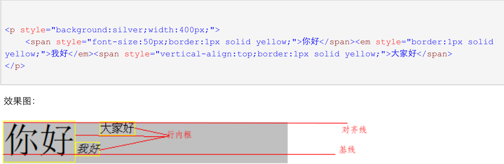
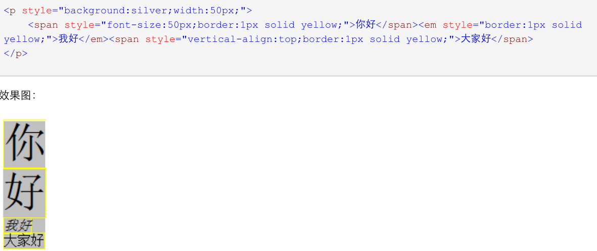
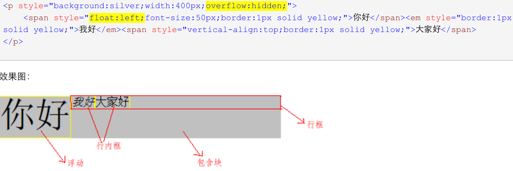
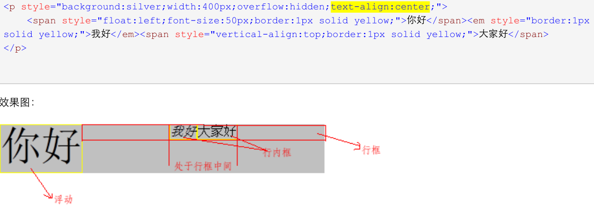
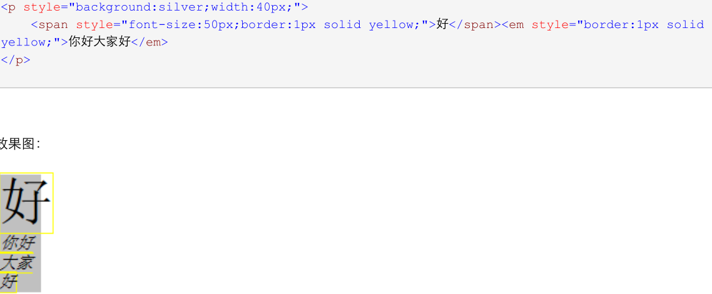
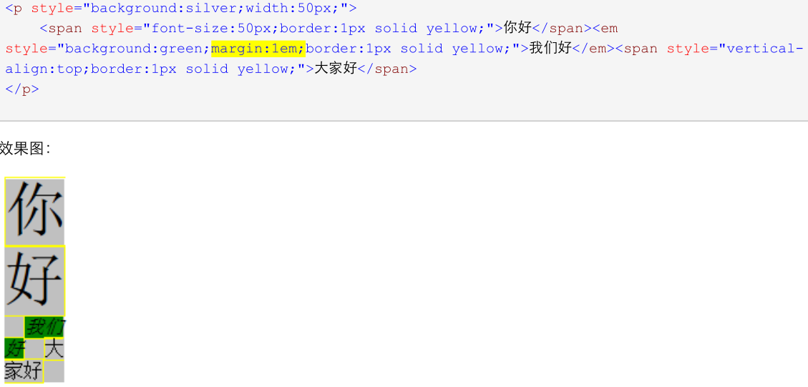

::: tip 1
行框的宽度不用在意、高度由行框内部 高处最高 和 低处最低 的元素共同决定、行内的元素对齐由vertical决定、默认值为baseline


:::

<!-- more -->

::: tip 2
如果行内元素太多而行宽不够时会形成新的一个行框、多个行框在垂直方向上堆叠形成一个段落、并且无法分割、高度不一定一样（由行内部元素决定）


:::

::: tip 3
> 其他兄弟元素对行框的影响：行框的可用宽度会减小


:::

::: tip 4
> 行内框在水平方向上的排布由text-align决定


:::

::: tip 5
> 如果行内框的宽度超出行框、就会被分割到多个行框中、除非行内框有white-space:nowrap、拓展：word-wrap:word-break、break-word:break-all、text-overflow:ellipsis


:::

::: tip 6
> 如果⼀一个⾏行内框被分割，margin，padding和border在所有分割处没有视觉效果。


:::

## 实现垂直居中的思路：

1、 在行中放入一个高度为100%的inline-block元素、设置其他元素为vertical-align:middle行框是无形的：只要有元素存在就会形成一个行

2、 通过flex，设置`align-items: center`，如果flex元素的高度塌陷，可以通过设置`line-height`，并且设置after如下：

```less
.content{
    display: flex;
    align-items: center;
    &:after{
        content: 'a',
        display:inline-block;
        width: 0;
        height: 100%;
        overflow: hidden;
    }
}
```

这样就能通过伪元素将元素高度撑开，实现flex的垂直居中效果
