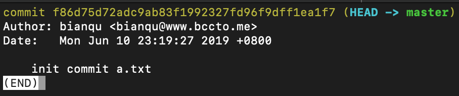
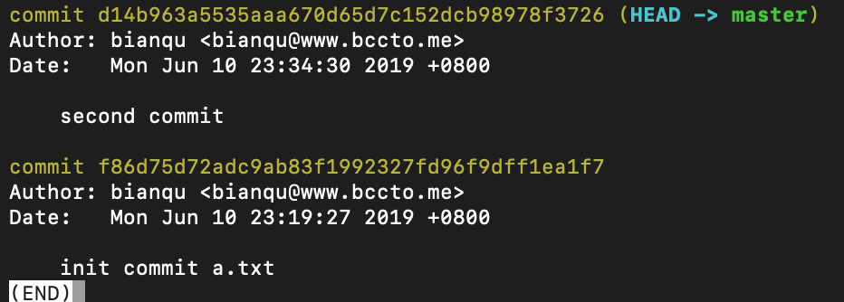

---
title: git撤销操作
date: 2019-06-10
tags:
  - git
--- 

一直不怎么记得住关于git操作的版本回退的一下姿势，于是对于一些简单的操作，写下来做个记录

## 第一次提交文件

首先，我们需要创建一个版本库

```bash
git init
```

这个时候文件夹内已有的或者是新创建的文件都处于`unstage`状态。通过`add`命令，往暂存区中添加一个文件

```bash
git add tsconfig.json
```

<!-- more -->

通过`git status`查看状态，得知现在暂存区中有一个新文件，并且提示

> 使用 "git rm --cached <文件>..." 以取消暂存

执行一下。

```bash
git rm --cached tsconfig.json
```

这个时候`tsconfig.json`的文件状态已经回到了工作区

> `git rm`的作用是用于取消git的跟踪，类似与`rm`命令符，不过`git rm`的作用相当与`rm + git add`。`--cached`的作用是告诉命令，当前操作只撤销修改，而不把文件从磁盘中删除

现在，我们新建一个a.txt，并将它提交到版本库

```bash
git add a.txt
git commit -m 'init commit a.txt'
```

现在我们得到一个commit



## 第二次提交

现在我们在a.txt中写下一段文本。通过`git status`可以看到git提示我们通过`git add`添加文件，或者通过`git checkout -- filename`撤销修改

这里`checkout`命令就是用于撤销工作区的修改的，撤销的结果是与上次commit时相同的内容

```bash
# 添加--表示是要回退文件，否则将会是切换分支
git checkout -- a.txt
```

> `checkout`回退文件，还可以指定分支或者某一次commitId

现在，修改a.txt的文件内容并提交到暂存区，这个时候应该怎么回退呢

git告诉我们可以通过`git reset HEAD <filename>`来取消暂存

```bash
git reset a.txt
```

默认情况下，reset会回退到HEAD版本下，这个时候，暂存区的信息没有了，但是在工作区内还能看到文件被修改的信息。并在磁盘上，文件内容没有被改变。同样的`reset`也可以指定回退的commitId，这个时候可以继续通过`checkout`命令撤销掉工作区的修改

现在，把文件内容提交到版本库，得到版本信息如下：



## 第三次提交

再次修改a.txt，如果我们想把文件回退到第一次提交时候的状态该怎么版呢，`checkout`是否可行呢

```bash
git checkout f86d -- a.txt
```

文件顺利的回退了，变成了初始化的状态，但是不会影响版本库的历史记录，相当于手动修改文件，并记录到暂存区

如果我们使用reset回退

```bash
git reset f86d a.txt
```

这样的情况下，reset不会修改工作空间，而是将工作空间与当前版本库的差异作为工作区的修改记录下来。

所以这个时候回退回去，通过status查看可以发现git告诉我们有更改还未提交

可以看出来checkout在回退文件的时候比reset更强势，它会丢弃一切暂存区和工作区的修改来保持跟版本库的一致

## 关于reset的参数

reset的时候有一个可选的强度参数:

- `--hard`：丢弃一切修改，与版本库保持一致

- `--soft`：保持工作区不变，版本库的差异记录到暂存区中

- `--mixed`：默认参数，将版本库的差异和之前暂存区的信息都记录为工作区的修改，作为撤销暂存区信息使用

## 如果不小心删错了文件

```bash
git checkout commitid -- a.txt
```

```bash
git reset commit a.txt
git checkout -- a.txt
```
