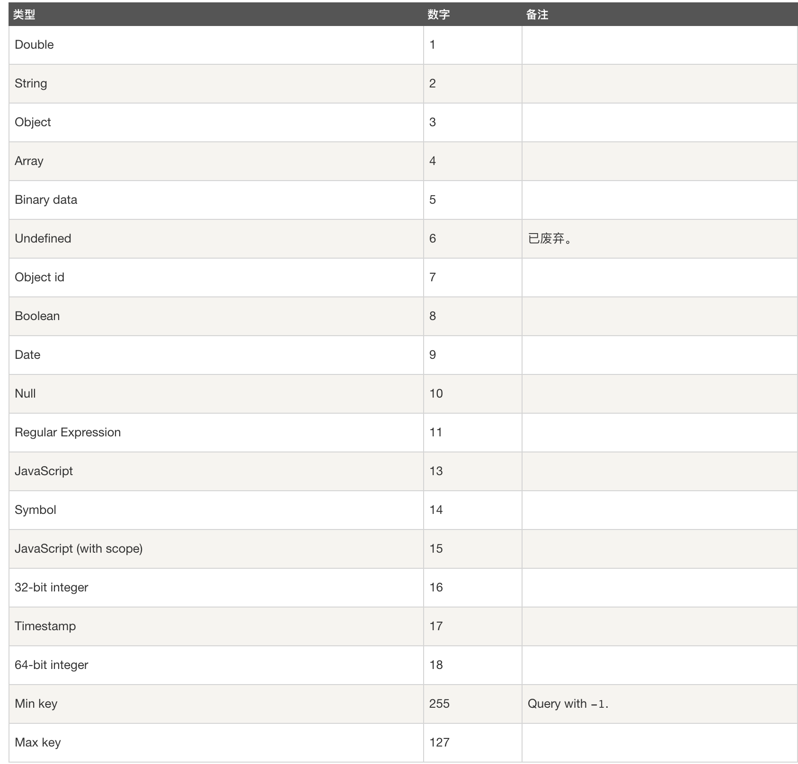

## 数据库命令

### 查看所有数据库

> show dbs

### 指定数据库

> use testbd

### 删除数据库

> db.dropDatabase()

## 集合命令

### 创建用户

> db.createUser({ user: "admin", pwd: "admin", roles: ["readWrite", "dbAdmin"] })

<!-- more -->

### 创建集合

> db.createColection("testcoll")

### 删除集合

> db.testcoll.drop()

### 插入数据

> db.testcoll.insert({index: 1})

> db.testcoll.insert([{index: 2}, {index: 3}])

> db.testcoll.save({index: 3})

**save方法，如果不指定 _id 字段 save() 方法类似于 insert() 方法。如果指定 _id 字段，则会更新该 _id 的数据**

### 查询数据

> db.testcoll.find()

> db.testcoll.find().pretty()

> db.testcoll.find({index: 2})


> db.testcoll.findOne({index: 2})

- **$or指定查询的多个条件**

> db.testcoll.find({ $or:[{inde: 2}, {index: 3}] })

- **$lt、$lte、$gt、$gte表示小于大于**

> db.testbd.find({index: { $gt: 2 }})

- $in表示值的范围

> db.testcoll.find({ likes: { $in: [200, 300] } })

- $exists筛选是否包含某个字段的文档

> db.testcoll.find({ istop: { $exists: true } })

- 嵌套查询

> db.testcoll.find({ "address.city":"Boston" })

- 使用正则

> db.testcoll.find({ title: /^我/})

- $type操作符

> db.col.find({ title: { $type: 2 } })

<!--  -->




#### 更新数据

> db.testcoll.update({index: 2}, {index: 2, updated: true})

> db.testcoll.update({index: 2}, { $set: {updated: true} })

**$set直接替换，$inc可实现数字累加，$unset删除某个字段**

e.g

```sh
# $set
db.testcoll.insert({index: 4, age: 12})
# { index: 4, age: 12 }
# $inc
db.testcoll.update({index: 4}, { $inc:{age: 5} })
# {index: 4, age: 17 }
# $unset
db.testcoll.update({index: 4}, {$unset:{gae: 0}})
# {index: 4}
```

- 在不存在的时候插入，存在的时候更新

> db.testcoll.update({index: 5}, {index: 5, addr: "qqq"}, { upsetrt: true })

- 更新找到的多条数据

> db.testcoll.update({index: 5}, { $set:{addr: "qq"} }, { multi: true })

- 字段更名

> db.testcoll.update({index: 5}, { $rename: { addr: "address" } })

### 删除数据

> db.testcoll.remove({index: 5})

> db.testcoll.remove({index: 5}, {justOne: true})

remove() 方法 并不会真正释放空间。 需要继续执行 db.repairDatabase() 来回收磁盘空间。

官方推荐使用 deleteOne() 和 deleteMany() 方法

> db.testcoll.deleteMany({})

> db.testcoll.deleteMany({ age: { $lte: 18 } })

> db.testcoll.deleteOne({ age: 18 })

### 排序

- 1升序

> db.testcoll.find().sort({ index: 1}) 

- -1降序

> db.testcoll.find().sort({ index: -1 })

### 数量

> db.testcoll.find().count()

- 获取前4条

> db.testcoll.find().limit(4)

e.g 找到大于且离3最近的一条数据

> db.testcoll.find({ index: { "gte": 3 } }).sort({ index: 1 }).limit(1)

- 跳过前面几条数据

> db.testcoll.find().skip(2)

### 聚合

#### 键值去从

返回值以数组形式呈现

> db.testcoll.distinct("user")

#### 

### forEach

> db.testcoll.find().forEach(function(doc){ print("index is: " + doc.index) })

### 索引

- 创建索引

> db.testcoll.createIndex({ title: 1, description: -1 })

- 查看索引

> db.testcoll.getIndexes()

- 查看集合索引大小

> db.testcoll.totalIndexSize()

- 删除集合所有索引

> db.testcoll.dropIndexes()

- 删除指定索引

> db.col.dropIndex("索引名称")

### 备份恢复

> mongodump -d testcoll

> mongorestore --drop


