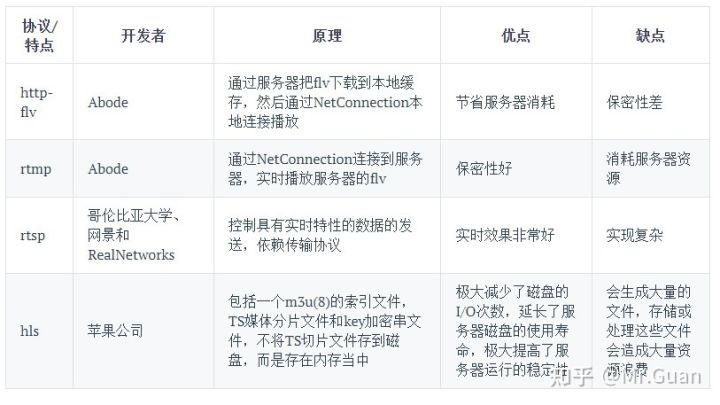
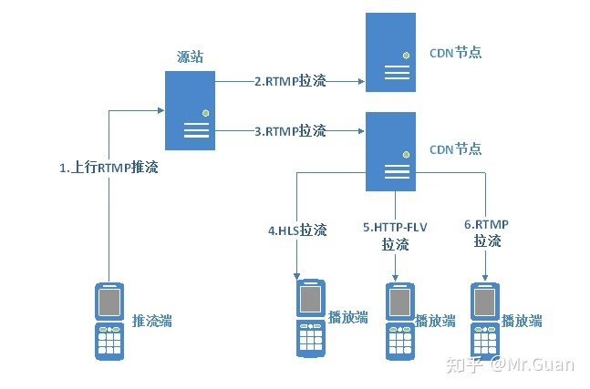
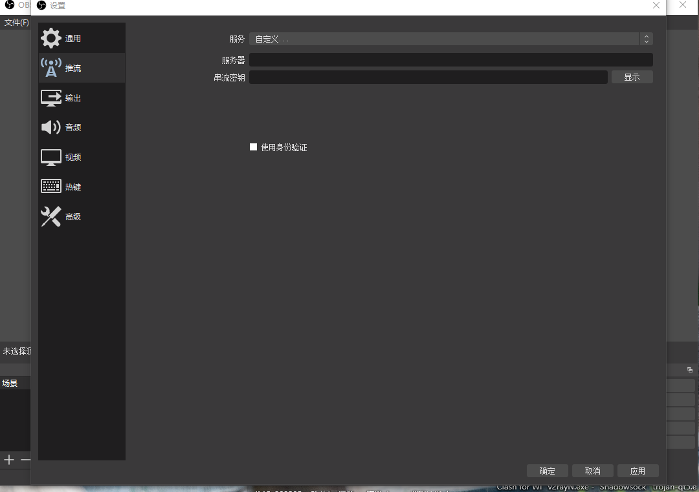

> 看到一篇帖子，关于 Nodejs 搭建直播服务器的，试了一下发现挺好玩的，这这里总结以下：[Node+OBS 直播服务器搭建总结 - MarkGuan 的文章 - 知乎 https://zhuanlan.zhihu.com/p/402372969](https://zhuanlan.zhihu.com/p/402372969)

## 直播流协议

先来了解一下基本的直播流协议


## 推流与拉流

- 推流：就是采集端将采集到的视频推送到服务器
- 拉流：就是客户端到指定的服务器地址拉去对应的流



## 搭建 Node 服务

安装`node-media-server`， [文档地址](https://www.npmjs.com/package/node-media-server)
编写文件

```javascript
// server.js
const nodeMediaServer = require('node-media-server');
const config = {
  rtmp: {
    port: 3001,
    chunk_size: 6000,
    gop_cache: true,
    ping: 30,
    ping_timeout: 60,
  },
  http: {
    port: 3002,
    allow_origin: '*',
  },
};

const nms = new nodeMediaServer(config);

nms.run();
```

启动后会输出如下信息：

```bash
npx nodemon index.mjs
[nodemon] 2.0.16
[nodemon] to restart at any time, enter `rs`
[nodemon] watching path(s): *.*
[nodemon] watching extensions: js,mjs,json
[nodemon] starting `node index.mjs`
2022/6/6 22:42:00 8060 [INFO] Node Media Server v2.3.12
2022/6/6 22:42:00 8060 [INFO] Node Media Rtmp Server started on port: 3001
2022/6/6 22:42:00 8060 [INFO] Node Media Http Server started on port: 3002
2022/6/6 22:42:00 8060 [INFO] Node Media WebSocket Server started on port: 3002
```

如果打印上述提示，表示服务器启动成功
推流地址：`rtmp://localhost:3001/channel`，
串流秘钥：`STREAM_NAME`,任意值
拉流地址：

- _rtmp_:` rtmp://localhost:port/live/STREAM_NAME`
- _http-flv_: `http://localhost:3002/live/STREAM_NAME.flv`
- _HLS_: `http://localhost:3002/live/STREAM_NAME/index.m3u8`
- _DASH_: `http://localhost:3002/live/STREAM_NAME/index.mpd`
- _websocket-flv_: `ws://localhost:3002/live/STREAM_NAME.flv`

比如：使用推流地址为:`rtmp://localhost:3001/myLive`，秘钥为：`secret`
那么拉流地址就是：`http://localhost:3002/mylive/secret.flv`

## 客户端集成

web 中通过`flv.js`进行拉流

```html
<!DOCTYPE html>
<html lang="en">
  <head>
    <meta charset="UTF-8" />
    <meta http-equiv="X-UA-Compatible" content="IE=edge" />
    <meta name="viewport" content="width=device-width, initial-scale=1.0" />
    <title>云直播</title>
    <style>
      #live {
        margin: 0 auto;
        display: block;
        min-width: 300px;
        max-width: 600px;
        width: 100%;
      }
    </style>
  </head>

  <body>
    <video
      id="live"
      playsinline
      controls
      src=""
      poster="./img/poster.jpg"
    ></video>
    <script src="js/flv.min.js"></script>
    <script>
      if (flvjs.isSupported()) {
        let ve = document.getElementById('live');
        let flvPlayer = flvjs.createPlayer({
          type: 'flv',
          url: 'http://localhost:3002/mylive/secret.flv',
        });
        flvPlayer.attachMediaElement(ve);
        flvPlayer.load();
        flvPlayer.play();
      }
    </script>
  </body>
</html>
```

## OBS 采集端配置

[OBS 下载地址](https://obsproject.com/)
在设置中找到推流设置，选择自定义，输入服务器地址：`rtmp://localhost:3001/mylive`和秘钥：`secret`

如果你要部署到线上的话，要保障你的服务器带宽至少在 10MB 左右，不然就会很卡的。
