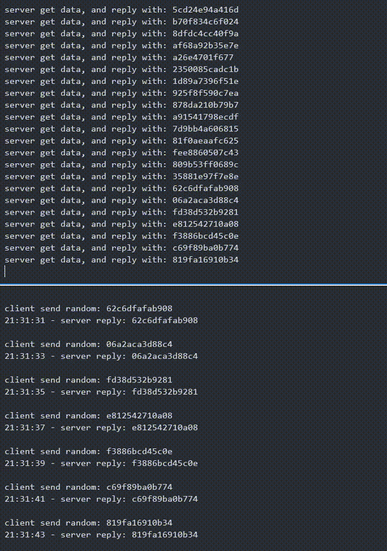

## 双向通信

双向通信值的是，服务端与客户端能够彼此交换信息，一般步骤如下：

1. 建立 socket 服务
2. 获取 client 对象
3. 读取 client 对象发送过来的数据
4. 将读取到的字符串反转
5. 获取 socket 中的输出流，将数据写入该流
6. 关闭客户端资源，关闭服务端资源

因此我们可以复用[上一节](./net.html)中的 server，同时为了后续我们能获取到 client 传输的数据等信息，我们还需要做额外的工作。在 nodejs 中，我们通过给 socket server 添加事件的方式来监听各种事件的发生

<!-- more -->

1. listening 事件

当 socket 调用 listen 方法的时候触发

```js
socket.on('listening', (e) => {
  console.log('listening', e);
});
```

2. error 事件

```js
socket.on('error', (error) => {
  console.log('error', error);
});
```

2. closed 事件

socket 关闭的时候触发，可以通过调用 close 方法

```js
socket.on('close', (e) => {
  console.log('closed', e);
});
```

3. connection 事件

当有客户端连接到 socket 的时候触发

```js
socket.on('connection', (client) => {});
```

同样的，在 client 中也有一些事件，常见的事件如下：

1. lookup-当进行 dns 查询的时候
2. connect - 连接成功
3. data - 接收到服务端的数据
4. end - 连接断开
5. timeout - 连接超时
6. drain
7. error - 出错
8. close - 连接关闭

基于以上的这些事件，我们就可以实现一个简易的双向通信服务。我们在客户端，每隔 2s 就向服务端发送一个随机数。服务端每一次收到客户端的数据的时候，都原样的返回数据，并添加时间戳

server 端代码如下

::: details server 端

```js
import net from 'net';

const server = net.createServer();

const clients = [];

server.on('connection', (socket) => {
  clients.push(socket);
  socket.write('Hello');
  socket.write('\n');

  socket.on('data', (chunk) => {
    console.log('server get data, and reply with: ' + chunk);
    const now = new Date();
    const hour = now.getHours();
    const minutes = now.getMinutes();
    const seconds = now.getSeconds();
    socket.write(
      `${hour}:${minutes}:${seconds} - ` + 'server reply: ' + chunk + '\n'
    );
  });

  socket.on('error', () => {
    console.log('client disconnect');
  });
});

server.listen(8000, () => {
  console.log('server starting');
});
```

:::

client 端代码如下

::: details client 端

```js
import net from 'net';

const client = net.connect({
  port: 8000,
});

client.on('lookup', () => {
  console.log('lookup');
});
client.on('connect', () => {
  console.log('connect');
});
client.on('end', () => {
  console.log('end');
});
client.on('timeout', () => {
  console.log('timeout 连接超时');
});
client.on('drain', () => {
  console.log('drain');
});
client.on('error', () => {
  console.log('服务端断开连接, 1s后重连');
  setTimeout(() => {
    client.connect({ port: 8000 });
  }, 1000);
});
client.on('close', () => {
  console.log('close');
});

client.on('data', (chunk) => {
  console.log(chunk.toString());
});

setInterval(() => {
  const random = Math.random()
    .toString('16')
    .slice(2);
  console.log('client send random: ' + random);
  client.write(random);
}, 2000);
```

:::

效果如下：


