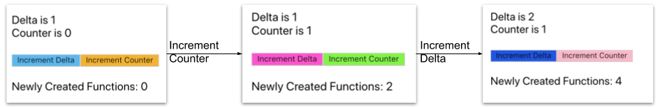
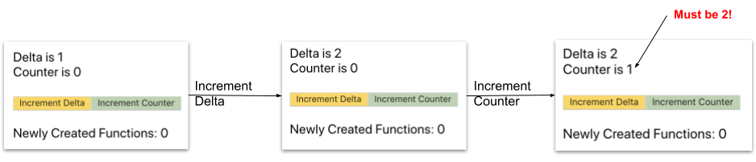
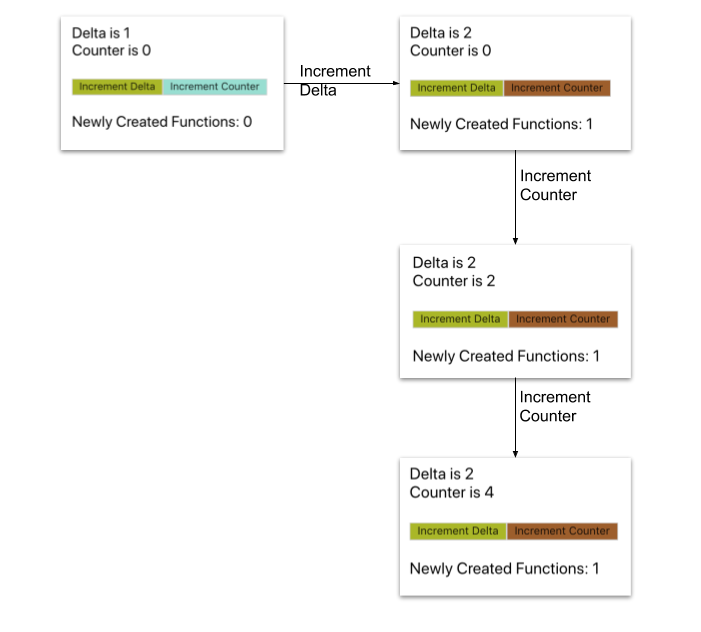

## 简介

我最近开始开始学习[React Hooks](https://reactjs.org/docs/hooks-reference.html)API，但是我还不知道怎么讲解这个知识。Hooks可以使我们用简单的几行表达曾经需要写十多行的功能。不幸的是，使用这些便利是需要付出代价的，我发现一些高级的hooks比如`useCallBack`和`useMemo`学习起来很困难，开始使用的时候会反直觉。

## 问题

在我们开始之前，先引入一个button组件。使用`React.memo`使之称为一个记忆组件，这会阻止React重新render它，除非它的属性发生变化。
我们还会添加一个随机颜色作为背景，以便我们可以跟踪它何时重新渲染

```tsx
import React, { useState, useCallback } from 'react';

// Generates random colours any time it's called
const randomColor = () => '#'+(Math.random()*0xFFFFFF<<0).toString(16);

// The type of the props
type ButtonProps = React.ButtonHTMLAttributes<HTMLButtonElement>;

// A memoized button with a random background colour
const Button = React.memo((props: ButtonProps) => 
  <button onClick={props.onClick} style={{color: randomColor()}}>
    {props.children}
  </button>
)
```

现在让我们看看以下简单的应用程序。

它显示2个数字 - 计数器`c`和`delta`。一个按钮允许用户将增量增加1.第二个按钮允许用户通过向其添加增量来增加计数器。我们将创建2个函数`increment`和`incrementDelta`，并将它们分配给按钮的on-click事件处理程序。让我们跟踪用户点击按钮时创建的这些函数的数量：

```jsx
import React, { useState } from 'react';

// Keeps track of all created functions during the app's life 
const functions: Set<any> = new Set();

const App = () => {
  const [delta, setDelta] = useState(1);
  const [c, setC] = useState(0);

  const incrementDelta = () => setDelta(delta => delta + 1);
  const increment = () => setC(c => c + delta);

  // Register the functions so we can count them
  functions.add(incrementDelta);
  functions.add(increment);

  return (<div>
    <div> Delta is {delta} </div>
    <div> Counter is {c} </div>
    <br/>
    <div>
      <Button onClick={incrementDelta}>Increment Delta</Button>
      <Button onClick={increment}>Increment Counter</Button>
    </div>
    <br/>
    <div> Newly Created Functions: {functions.size - 2} </div>
  </div>)
}
```

当我们运行应用程序并开始单击按钮时，我们会发现一些有趣的事情每按一下按钮，就有2个新创建的功能！此外，两个按钮都会在每次更改时重新渲染！



换句话说，在每次重新渲染时，我们都会创建2个新函数。如果我们增加c，为什么我们需要重新创建`incrementDelta`函数？这不仅仅是关于内存 - 它会导致子组件不必要地重新渲染。这很快就会成为性能问题。

一种解决方案是将两个功能移到App功能组件之外。不幸的是，这不起作用，因为他们使用App范围内的状态变量。

## 简单的解决方案 - 为什么依赖关系很重要

这就是`useCallback`钩子的用武之地。它将一个函数作为一个参数并返回它的缓存/记忆版本。它还需要第二个参数，稍后将介绍。让我们用`useCallBack`重写：

```jsx
const App = () => {
  const [delta, setDelta] = useState(1);
  const [c, setC] = useState(0);

  // No dependencies (i.e. []) for now
  const incrementDelta = useCallback(() => setDelta(delta => delta + 1), []);
  const increment = useCallback(() => setC(c => c + delta), []);

  // Register the functions so we can count them
  functions.add(incrementDelta);
  functions.add(increment);

  return (<div>
    <div> Delta is {delta} </div>
    <div> Counter is {c} </div>
    <br/>
    <div>
      <Button onClick={incrementDelta}>Increment Delta</Button>
      <Button onClick={increment}>Increment Counter</Button>
    </div>
    <br/>
    <div> Newly Created Functions: {functions.size - 2} </div>
  </div>)
}
```

这可以防止实现新功能和不必要的重新渲染。但是，当我们重新运行应用程序时，我们注意到我们已经引入了一个错误。如果我们将`detla`增加到2，然后尝试递增计数器，则其值增加1，而不是2：



这是因为在增量函数实例化时，delta的值为1，这是在函数范围内捕获的。由于我们正在缓存增量实例，因此它永远不会重新创建，它使用其原始范围与detla = 1。

`useCallback`钩子创建了一个增量的缓存版本，它封装了`delta`的初始值。当App使用不同的`delta`值重新渲染时，`useCallback`返回增量函数的先前版本，该函数保留第一次渲染的旧值`delta`。

我们需要告诉`useCallback`为`delta`的每次更改创建新的缓存增量版本。

## 依赖

这是`useCallback`的第二个论点。它是一个值数组，表示缓存的依赖关系。在任何两个后续的重新渲染中，如果依赖项的值相等，`useCallback`将返回相同的缓存函数实例。

我们可以使用依赖项来解决以前的错误：

```jsx
  const incrementDelta = useCallback(() => setDelta(delta => delta + 1), []);

  // Recreate increment on every change of delta!
  const increment = useCallback(() => setC(c => c + delta), [delta]);
```

现在我们可以看到只有当delta发生变化时才会创建一个新的增量函数。因此，计数器按钮仅在增量更改时重新呈现，因为添加了onClick属性的新实例。**换句话说，我们只创建一个新的回调，如果它使用的闭包部分（即依赖关系）自上一次渲染以来已经改变。**



useCallback的一个非常有用的功能是，如果依赖项没有改变，它将返回相同的函数实例。因此我们可以在其他钩子的依赖列表中使用它。例如，让我们创建一个缓存/ memoized函数，它增加两个数字：
```jsx
const incrementDelta = useCallback(() => setDelta(delta => delta + 1), []);
const increment = useCallback(() => setC(c => c + delta), [delta]);

// Can depend on [c1, c2] instead, but it would be brittle
const incrementBoth = useCallback(() => {
    incrementDelta();
    increment();
}, [increment, incrementDelta]); 
```

新的`incrementBoth`函数传递依赖于`delta`。我们可以编写`useCallback（...，[delta]）`，这样可行。但是，这是一种非常脆弱的方法！如果我们改变了`increment`或`incrementDelta`的依赖关系，我们必须记住改变`incrementBoth`的依赖关系。

由于`increment`和`incrementDelta`的引用不会改变，除非它们的依赖关系改变，我们可以使用它们。传递依赖可以忽略！这使得一个简单的规则：

::: tip
必须使用useCallback对在功能组件范围内声明的每个函数进行memoized / cached。如果它引用组件范围中的函数或其他变量，则应将它们列在其依赖项列表中。
:::

此规则可以由linter强制执行，该linter检查您的useCallback缓存依赖项是否一致。

## useCallback and useMemo

React引入了另一个名为`useMemo`的类似钩子。它有类似的签名，但工作方式不同。与缓存提供的函数实例的`useCallback`不同，`useMemo`调用提供的函数并缓存其结果。

换句话说，`useMemo`缓存计算值。当计算需要大量资源并且我们不想在每次重新渲染时重复它时，这很有用，如下例所示：

```jsx
const [c, setC] = useState(0);

// This value will not be recomputed between re-renders
// unless the value of c changes
const sinOfC1: number = useMemo(() => Math.sin(c) , [c])
```

与`useCallback`一样，`useMemo`返回的值可以用作其他钩子的依赖项。

另外，`useMemo`也可以缓存一个函数值。换句话说，它是`useCallback`的通用版本，可以替换它，如下例所示

```jsx
// Some function ...
const f = () => { ... }

// The following are functionally equivalent
const callbackF = useCallback(f, [])
const callbackF = useMemo(() => f, [])
```