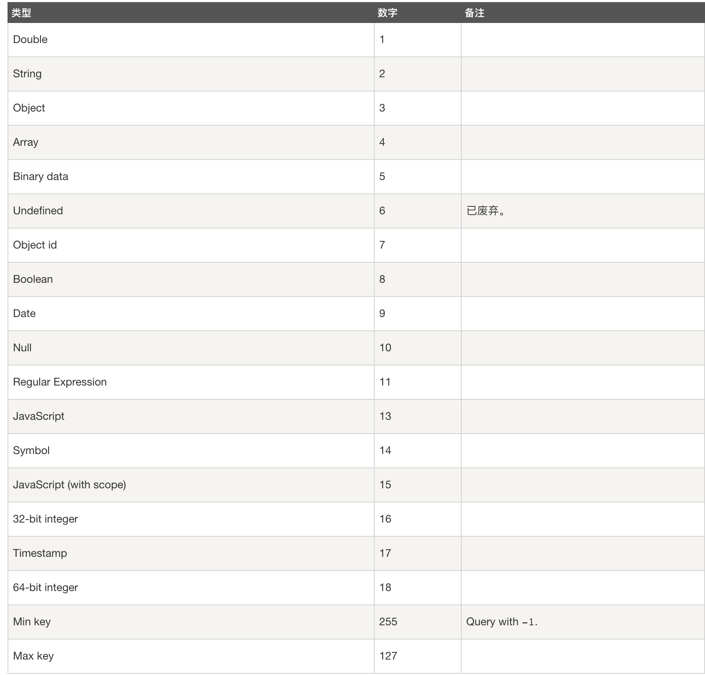

## 数据库命令

### 查看所有数据库

> show dbs

### 指定数据库

> use testbd

### 删除数据库

> db.dropDatabase()

## 集合命令

### 创建用户

> db.createUser({ user: "admin", pwd: "admin", roles: ["readWrite", "dbAdmin"] })

<!-- more -->

### 创建集合

> db.createColection("testcoll")

### 删除集合

> db.testcoll.drop()

### 插入数据

> db.testcoll.insert({index: 1})

> db.testcoll.insert([{index: 2}, {index: 3}])

> db.testcoll.save({index: 3})

**save 方法，如果不指定 \_id 字段 save() 方法类似于 insert() 方法。如果指定 \_id 字段，则会更新该 \_id 的数据**

### 查询数据

通过 find 可以查询符合条件的数据

```js
// 找到所有年龄大于12的数据
db.testcoll.find({ age: { $gt: 12 } });
// 只查找一个
db.testcoll.findOne({ index: 2 });
```

通过 project 过滤返回数据的字段

```js
// 找到所有年龄大于12的数据,只包含name字段
db.testcoll.find({ age: { $gt: 12 } }, { name: 1 });
// 找到所有年龄大于12的数据,不包含age字段
db.testcoll.find({ age: { $gt: 12 } }, { age: 0 });
```

默认返回的数据中都包含`_id`字段

- **\$or 指定查询的多个条件**

> db.testcoll.find({ \$or:[{inde: 2}, {index: 3}] })

- **$lt、$lte、$gt、$gte 表示小于大于**

> db.testbd.find({index: { \$gt: 2 }})

- \$in 表示值的范围

> db.testcoll.find({ likes: { \$in: [200, 300] } })

- \$exists 筛选是否包含某个字段的文档

> db.testcoll.find({ istop: { \$exists: true } })

- 嵌套查询

> db.testcoll.find({ "address.city":"Boston" })

- 使用正则

> db.testcoll.find({ title: /^我/})

- \$type 操作符

> db.col.find({ title: { \$type: 2 } })

<!--  -->



#### 更新数据

> db.testcoll.update({index: 2}, {index: 2, updated: true})

> db.testcoll.update({index: 2}, { \$set: {updated: true} })

**$set直接替换，$inc 可实现数字累加，\$unset 删除某个字段**

e.g

```sh
# $set
db.testcoll.insert({index: 4, age: 12})
# { index: 4, age: 12 }
# $inc
db.testcoll.update({index: 4}, { $inc:{age: 5} })
# {index: 4, age: 17 }
# $unset
db.testcoll.update({index: 4}, {$unset:{gae: 0}})
# {index: 4}
```

- 修改数组中的某一项

```js
db.testcoll.update({ index: 5 }, { $set: { 'list.0': 'newItem' } });
```

- 在不存在的时候插入，存在的时候更新

> db.testcoll.update({index: 5}, {index: 5, addr: "qqq"}, { upsetrt: true })

- 更新找到的多条数据

> db.testcoll.update({index: 5}, { \$set:{addr: "qq"} }, { multi: true })

- 字段更名

> db.testcoll.update({index: 5}, { \$rename: { addr: "address" } })

### 删除数据

> db.testcoll.remove({index: 5})

> db.testcoll.remove({index: 5}, {justOne: true})

remove() 方法 并不会真正释放空间。 需要继续执行 db.repairDatabase() 来回收磁盘空间。

官方推荐使用 deleteOne() 和 deleteMany() 方法

```bash
db.testcoll.deleteMany({})

db.testcoll.deleteMany({ age: { \$lte: 18 } })

db.testcoll.deleteOne({ age: 18 })
```

### 排序

- 1 升序

> db.testcoll.find().sort({ index: 1})

- -1 降序

> db.testcoll.find().sort({ index: -1 })

### 数量

> db.testcoll.find().count()

- 获取前 4 条

> db.testcoll.find().limit(4)

e.g 找到大于且离 3 最近的一条数据

> db.testcoll.find({ index: { "gte": 3 } }).sort({ index: 1 }).limit(1)

- 跳过前面几条数据

> db.testcoll.find().skip(2)

### 聚合

#### 键值去从

返回值以数组形式呈现

> db.testcoll.distinct("user")

####

### forEach

> db.testcoll.find().forEach(function(doc){ print("index is: " + doc.index) })

### 索引

- 创建索引

> db.testcoll.createIndex({ title: 1, description: -1 })

- 查看索引

> db.testcoll.getIndexes()

- 查看集合索引大小

> db.testcoll.totalIndexSize()

- 删除集合所有索引

> db.testcoll.dropIndexes()

- 删除指定索引

> db.col.dropIndex("索引名称")

### 备份恢复

> mongodump -d testcoll

> mongorestore --drop

## 导出

```
mongodump --port 27017 --out ./backup  --db school --collection users
# 全部备份
mongodump --port 27017 --out ./backup
```

## 恢复

```
mongorestore ./backup
```
