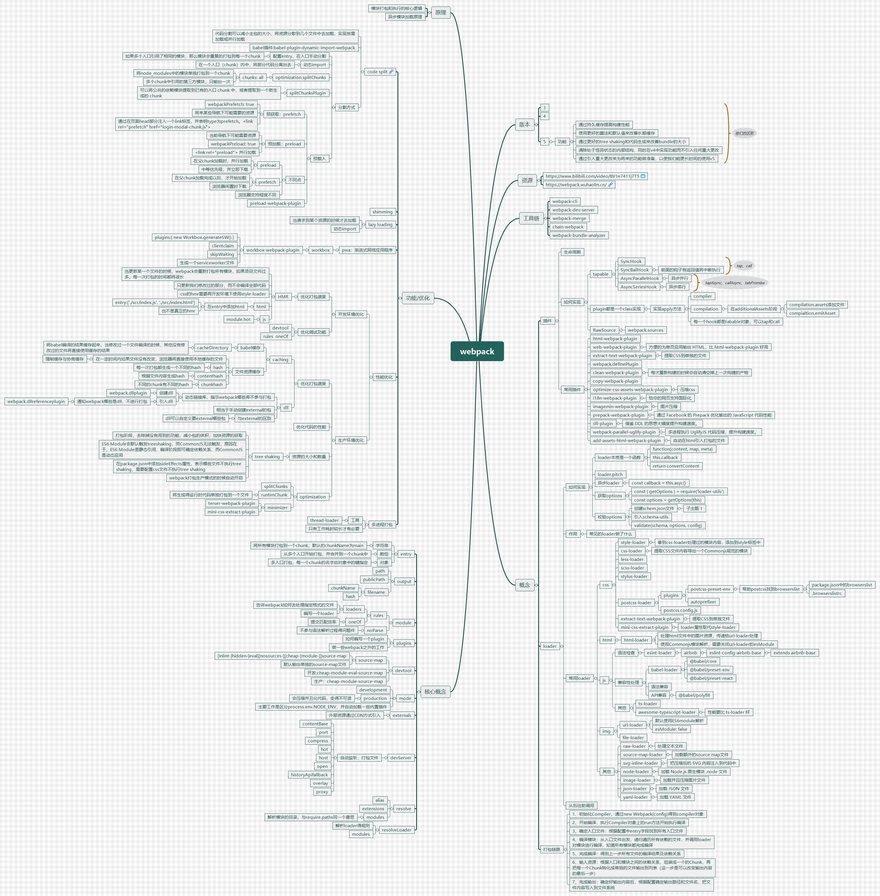

> 初步整理的 webpack 知识图谱

# webpack

<!-- ## 版本

### 3

### 4

### 5 -->

- 功能

  - 通过持久缓存提高构建性能
  - 使用更好的算法和默认值来改善长期缓存
  - 通过更好的 tree shaking 和代码生成来改善 bundle 的大小
  - 清除处于怪异状态的内部结构，同时在 v4 中实现功能而不引入任何重大更改
  - 通过引入重大更改来为将来的功能做准备，以使我们能更长时间的使用 v5

## 资源

- [https://www.bilibili.com/video/BV1e7411j7T5](https://www.bilibili.com/video/BV1e7411j7T5)

- [https://webpack.wuhaolin.cn/](https://webpack.wuhaolin.cn/)

## 工具链

### webpack-cli

### webpack-dev-server

### webpack-merge

### chain-webpack

### webpack-bundle-analyzer

## 概念

### 插件

- 生命周期
- 如何实现

  - tapable

    - SyncHook
    - SyncBailHook

      - 前面的钩子有返回值将中断执行

    - AsyncParallelHook

      - 异步并行

    - AsyncSeriesHook

      - 异步串行

  - plugin 都是一个 class 实现

    - 实现 apply 方法

      - complier
      - compilation

        - 在 additionalAssets 阶段

          - compilation.assets 添加文件
          - compialtion.emitAsset

      - 每一个 hook 都是 tabable 对象，可以 tap 和 call

  - RawSource

    - webpack.sources

- 常用插件

  - html-webpack-plugin
  - web-webpack-plugin

    - 方便的为单页应用输出 HTML，比 html-webpack-plugin 好用

  - extract-text-webpack-plugin

    - 提取 CSS 到单独的文件

  - webpack.definePlugin
  - clean-webpack-plugin

    - 每次重新构建的时候会自动清空掉上一次构建的产物

  - copy-webpack-plugin
  - optimize-css-assets-webpack-plugin

    - 压缩 css

  - i18n-webpack-plugin

    - 给你的网页支持国际化

  - imagemin-webpack-plugin

    - 图片压缩

  - prepack-webpack-plugin

    - 通过 Facebook 的 Prepack 优化输出的 JavaScript 代码性能

  - dll-plugin

    - 借鉴 DDL 的思想大幅度提升构建速度。

  - webpack-parallel-uglify-plugin

    - 多进程执行 UglifyJS 代码压缩，提升构建速度。

  - add-assets-html-webpack-plugin

    - 自动在 html 引入打包的文件

### loader

- 如何实现

  - loader 本质是一个函数

    - function(content, map, meta)
    - this.callback
    - return convertContent

  - loader.pitch
  - 异步 loader

    - const callback = this.asyc()

  - 获取 options

    - const { getOptions } = require('loader-utils')
    - const options = getOptions(this)

  - 校验 options

    - 创建 schem.json 文件

      - 子主题 1

    - 引入 schema-utils
    - validate(schema, options, config)

- 作用

  - 常见的 loader 做了什么

- 常用 loader

  - css

    - style-loader

      - 拿到 css-loader 处理过的模块内容，添加到 style 标签中

    - css-loader

      - 提取 CSS 文件内容导出一个 Commonjs 规范的模块

    - less-loader
    - scss-loader
    - stylus-loader
    - postcss-loader

      - plugins

        - postcss-preset-env

          - 帮助 postcss 找到 browserslist

            - package.json 中的 browserslist
            - .browserslistrc

        - autoprefixer

      - postcss.config.js

    - extract-text-webpack-plugin

      - 提取 CSS 到单独文件

    - mini-css-extract-plugin

      - loader 属性取代 style-loader

  - html

    - html-loader

      - 处理 html 文件中的图片资源，传递给 url-loader 处理
      - 使用 Commonjs 模块解析，需要关闭 url-loader 的 esModule

  - js

    - 语法检查

      - esint-loader

        - airbnb

          - eslint-config-airbnb-base

            - extends airbnb-base

    - 兼容性处理

      - babel-loader

        - @babel/core
        - @babel/preset-env
        - @babel/preset-react

      - 语法兼容
      - API 兼容

        - @babel/polyfill

    - 其他

      - ts-loader
      - awesome-typescript-loader

        - 性能要比 ts-loader 好

  - img

    - url-loader

      - 默认使用 ES6module 解析
      - esModule: false

    - file-loader

  - 其他

    - raw-loader

      - 处理文本文件

    - source-map-loader

      - 加载额外的 source map 文件

    - svg-inline-loader

      - 把压缩后的 SVG 内容注入到代码中

    - node-loader

      - 加载 Node.js 原生模块 .node 文件

    - image-loader

      - 加载并且压缩图片文件

    - json-loader

      - 加载 JSON 文件

    - yaml-loader

      - 加载 YAML 文件

- 从后往前调用

### 打包链路

- 1、初始化 Compiler，通过 new Webpack(config)得到 compiler 对象
- 2、开始编译，执行 Compiler 对象上的 run 方法开始执行编译
- 3、确定入口文件：根据配置中 entry 字段找到所有入口文件
- 4、编译模块：从入口文件出发，递归遍历所有依赖的文件，并调用 loader 对模块进行编译，知道所有模块都完成编译
- 5、完成编译：得到上一步所有文件的编译结果及依赖关系
- 6、输入资源：根据入口和模块之间的依赖关系，组装成一个的 Chunk，再把每一个 Chunk 转化成单独的文件输出到列表（这一步是可以改变输出内容的最后一步）
- 7、完成输出：确定好输出内容后，根据配置确定输出路径和文件名，把文件内容写入到文件系统

## 核心概念

### entry

- 字符串

  - 将所有模块打包到一个 chunk，默认的 chunkName 为 main

- 数组

  - 从多个入口开始打包，并合并到一个 chunk 中

- 对象

  - 多入口打包，每一个 chunk 的名字由对象中的键指定

### output

- path
- publicPath
- filename

  - chunkName
  - hash

### module

- rules

  - loaders

    - 告诉 webpack 如何去处理指定格式的文件
    - 编写一个 loader

  - oneOf

    - 提交匹配效率

- noParse

  - 不参与语法解析过程得问题件

### plugins

- 如何编写一个 plugin
- 做一些 webpack 之外的工作

### devtool

- source-map

  - [inlint-|hidden-|eval][nosources-][cheap-[module-]]source-map
  - 默认输出单独的 source-map 文件

- 开发:cheap-module-eval-source-map
- 生产：cheap-module-source-map

### mode

- development
- production

  - 会压缩并丑化代码，变得不可读

- 主要工作是区分 process.env.NODE_ENV，并自动加载一些内置插件

### externals

- 外部资源通过 CDN 方式引入

### devServer

- 自动监听，打包文件

  - contentBase
  - port
  - compress
  - hot
  - host
  - open
  - historyApifallback
  - overlay
  - proxy

### resolve

- alias
- extensions
- modules

  - 解析模块的目录，与 require.paths 同一个意思

### resolveLoader

- 解析 loader 得规则
- modules

## 功能/优化

### code split

- 代码分割可以减小主包的大小，将资源分散到几个文件中去加载，实现按需加载或并行加载
- babel 插件:babel-plugin-dynamic-import-webpack
- 分割方式

  - 配置 entry，在入口手动分割

    - 如果多个入口引用了相同的模块，那么模块会重复的打包到每一个 chunk

  - 动态 import

    - 在一个入口（chunk）内中，将部分代码分离出去

  - optimization.splitChunks

    - chunks: all

      - 将 node_modules 中的模块单独打包到一个 chunk
      - 多个 chunk 中引用的第三方模块，只输出一次

  - splitChunksPlugin

    - 可以将公共的依赖模块提取到已有的入口 chunk 中，或者提取到一个新生成的 chunk

  - 预载入

    - 预获取：prefetch

      - webpackPrefetch: true
      - 将来某些导航下可能需要的资源
      - 通过在页面 head 部分注入一个 link 标签，并表明 type 为 prefetch。<link rel="prefetch" href="login-modal-chunk.js">

    - 预加载：preload

      - 当前导航下可能需要资源
      - webpackPreload: true
      - <link rel="preload"> 并行加载

    - 不同点

      - preload

        - 在父 chunk 加载时，并行加载
        - 中等优先级，并立即下载

      - prefetch

        - 在父 chunk 加载完成以后，才开始加载
        - 浏览器闲置时下载

      - 浏览器支持程度不同

    - preload-webpack-plugin

### shimming

### lazy loading

- 当请求到某个资源的时候才去加载
- 动态 import

### pwa：渐进式网络应用程序

- workbox

  - workbox-webpack-plugin

    - plugins:[ new Workbox.generateSW() ]
    - clientclaim
    - skipWaiting
    - 生成一个 serviceworker 文件

### 性能优化

- 开发环境优化

  - 优化打包速度

    - [HMR](./HMR)

      - 当更新某一个文件的时候，webpack 会重新打包所有模块，如果项目文件过多，每一次打包的时间都将很长
      - 只更新我们修改过的部分，而不会编译全部代码
      - css 的 hmr 需要再开发环境下使用 style-loader
      - html

        - 在 entry 中添加 html

          - entry:['./scr/index.js', './src/index.html']
          - 也不是真正的 hmr

      - js

        - module.hot

  - 优化调试功能

    - devtool
    - rules oneOf

- 生产环境优化

  - 优化打包速度

    - caching

      - babel 缓存

        - cacheDirectory

          - 将 babel 编译的结果缓存起来，当修改过一个文件编译的时候，其他没有修改过的文件将直接使用缓存的结果

      - 文件资源缓存

        - 在一定时间内如果文件没有改变，浏览器将直接使用本地缓存的文件

          - 强制缓存与协商缓存

        - hash

          - 每一次打包都生成一个不同的 hash

        - contenthash

          - 根据文件内容生成 hash

        - chunkhash

          - 不同的 chunk 有不同的 hash

    - dll

      - 动态链接库，指示 webpack 哪些库不参与打包

        - 创建 dll

          - webpack.dllplugin

        - 引入 dll

          - 通知 webpack 哪些是 dll，不进行打包

            - webpack.dllreferenceplugin

      - 相当于手动创建 external 的包
      - 与 external 的区别

        - dll 可以自定义要 external 哪些包

  - 优化代码的性能
  - 资源的大小和数量

    - tree shaking

      - 打包阶段，去除掉没有用到的功能，减小包的体积，加快资源的获取
      - ES6 Module 会默认触发 treeshaking，而 CommonJS 无法触发，原因在于，ES6 Module 是静态引用，编译阶段即可确定依赖关系，而 CommonJS 是动态应用
      - 在 package.json 中添加 sideEffects 属性，表示哪些文件不执行 tree shaking，需要配置 css 文件不执行 tree shaking
      - webpack 打包生产模式的时候自动开启

  - optimization

    - splitChunks
    - runtimChunk

      - 将生成得运行时代码单独打包到一个文件

    - minimizer

      - terser-webpack-plugin
      - mini-css-extract-plugin

### 多进程打包

- 工具

  - thread-loader

- 只有工作耗时较长才有必要

## 原理

### 模块打包和执行的核心逻辑

### 异步模块加载原理
