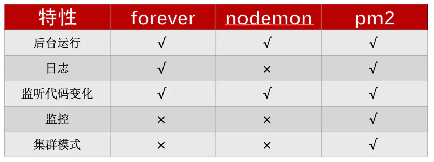
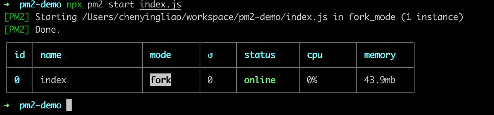

PM2 是用于 Nodejs 的生产流程管理器，简单的说就是管理我们部署在生产环境的 nodejs 应用。具有一下特点：

- 内置的负载均衡器
- 热重载（跟 nginx 的 reload 一样）
- 本机集群管理
- 自动 relive。比如应用不小心被 kill 掉、或者 crash 掉之后会重新拉起来
- 日志功能




pm2 不仅能够管理 node 应用，还支持 python、ruby、php 等

## 入门

先做好准备工作，写一个简单的 demo 方便测试

```javascript
mkdir pm2-demo && cd pm2-demo
yarn init -y
yarn add pm2 -D # 本地安装pm2
vi index.js
```

index.js 内容如下：

```javascript
const http = require('http');

const server = http.createServer((req, res) => {
  res.end('Hello');
});

server.listen(8111, () => {
  console.log('server started on port 8111');
});
```

准备就绪，下一步就可以通过 pm2 来启动我们的应用
平常通过 node 启用的话，控制台会一直挂起，关掉控制台应用就停止了。而 pm2 管理的应用则会默认后台运行，不占据前台的窗口
`npx pm2 start index.js`，控制台给我们返回了如下的信息：



注意其中的关键信息：id、name、mode、instance。此时应用已经在后台启动了，可以访问`http://localhost:8111`来验证
有如下一些命令可以查看应用:

- pm2 list：查看当前所有的应用
- pm2 describe [id]：查看应用的详情
- pm2 env [id]：查看应用启动的环境变量
- pm2 monit：实时监控所有应用的运行情况，比如日志，内存占用，堆大小等

### 基于内存的重启

如果应用的数据没有很好的 GC，随着时间推移，内存占用会越来越大，此时我们可以让 pm2 帮我们重启应用，让系统回收掉这部分内存
`npx pm2 start index.js --max-memory-restart 20M`
查看监控 pm2 monit，可以检测到应用的重启，也可以通过`ps -ef | grep pm2`看到相应的 PID 在发生变化

### 手动重启

比方说项目更新以后需要不停机重启

```javascript
npx pm2 restart [appname | appid]
```

> 来自官方的警告：此功能仅适用于使用 HTTP/HTTPS/socket 连接的 *cluster_mode*中的应用

### 日志

除了在`pm2 ponit`监控中查看日志，还可以直接通过`pm2 logs`查看，其他日志相关 api：

- `pm2 flush`：清空日志
- `pm2 logs index`：查看指定日志
- `pm2 reloadLogs` 重载所有日志

#### 日志路径

日志默认会生成在`~/.pm2`目录下，比如`~/.pm2/logs`。其中`~/.pm2/logs/index-error.log`就是 index 应用的错误日志，`~/.pm2/logs/index-out.log`就是 index 的普通日志

#### 输出重定向

如果希望所有的日志都输出到同一个文件，可以将日志输出重定向到其他文件，命令行参数为`-o`和`-e`

```bash
npx pm2 start index.js -o index.log -e index.log
```

如果希望输出到统一文件，并保留独立文件，可以用`-l`参数

```bash
# 自动命名
npx pm2 start index.js -l
# 手动命名
npx pm2 start index.js -l index.js
```

`merge_logs`可以将所有应用的日志统一输出到一个地方

```bash
npx pm2 start index.js --merge-logs
```

### 集群管理

集群模式会自动将应用打包到集群模块中，使得在不停机的状态下重新加载应用，并在所有可用的 CPU 上扩展进程
使用集群模式，需要传递一个`-i`选项

```bash
npx pm2 start index.js -i 2
```

如果要占满 CPU 的核心数，就将`-i`的参数改为 0

```bash
npx pm2 start index.js -i 0
# 等价写法，不过已弃用
npx pm2 start index.js -i max
```

### 配置文件写法

```javascript
module.exports = {
  apps: [
    {
      name: 'node-app',
      cwd: '/srv/node-app/current',
      args: "['--toto=heya coco', '-d', '1']",
      script: 'bin/app.js',
      node_args: ['--harmony', ' --max-stack-size=102400000'],
      log_date_format: 'YYYY-MM-DD HH:mm Z',
      error_file: '/var/log/node-app/node-app.stderr.log',
      out_file: 'log/node-app.stdout.log',
      pid_file: 'pids/node-geo-api.pid',
      instances: 6, //or 0 => 'max'
      min_uptime: '200s', // 200 seconds, defaults to 1000
      max_restarts: 10, // defaults to 15
      max_memory_restart: '1M', // 1 megabytes, e.g.: "2G", "10M", "100K", 1024... the default unit is byte.
      cron_restart: '1 0 * * *',
      watch: false,
      ignoreWatch: ['[\\/\\\\]\\./', 'node_modules'],
      merge_logs: true,
      exec_interpreter: 'node',
      exec_mode: 'fork',
      env: {
        NODE_ENV: 'production',
        AWESOME_SERVICE_API_TOKEN: 'xxx',
      },
    },
  ],
};
```

或者 json 格式

```json
{
  "apps": [
    {
      "name": "my-app"
    }
  ]
}
```

## 部署的一般流程

1. 生成配置文件

```bash
npx pm2 ecosystem
npx pm2 init
```

会在项目根目录下生成一个`ecosystem.config.js`文件，内容如下：

```javascript
module.exports = {
  apps: [
    {
      script: 'index.js',
      watch: '.',
      env: {},
      env_production: {},
    },
    {
      script: './service-worker/',
      watch: ['./service-worker'],
    },
  ],

  deploy: {
    production: {
      user: 'SSH_USERNAME',
      host: 'SSH_HOSTMACHINE',
      ref: 'origin/master',
      repo: 'GIT_REPOSITORY',
      path: 'DESTINATION_PATH',
      'pre-deploy-local': '',
      'post-deploy':
        'npm install && pm2 reload ecosystem.config.js --env production',
      'pre-setup': '',
    },
    dev: {
      user: 'xxl',
      host: '0.0.0.0',
      ref: 'origin/master',
      repo: '[email protected]:repo.git',
      path: '/Users/chenyingliao/workspace/pm2-demo',
      'post-deply':
        'npm install && npx pm2 startOrRestart ecosystem.json --env dev',
      env: {
        NODE_ENV: 'dev',
      },
    },
  },
};
```

通过配置文件启动

```bash
npx pm2 start ecosystem.config.js
```

2.远程部署
因为部署的时候是通过 ssh 到远程机器的，所以需要保证本地生成密钥，生成方式

```bash
ssh-keygen -t rsa -C email
# 将密钥传到远程服务器
ssh-copy-id -i "~/.ssh/id_rsa.pub" user@host
```

生成好了之后就可以到初始化远程，比如

```bash
npx pm2 deploy ecosystem.config.js dev setup
```

就可以根据 dev 的相关配置去进行初始化
启动命令如下：

```bash
npx pm2 deploy ecosystem.config.js dev
```

### deploy 子命令

- setup 初始化
- update 更新远程的配置
- revert [n] 回滚[n]个版本
- curr[ent] 输出当前的信息
- prev[ious] 输出上一次部署的信息
- list 列出所有历史信息
- ref 部署指定的这个分支

### 其他部署命令

在 post-deploy 中执行启动相关的命令，除了 startOrRestart，还有以下命令

```bash
pm2 startOrRestart xx.js
pm2 startOrReload xx.js
pm2 startOrGracefulReload xx.js
```

## 常用配置说明

`apps`： json 结构，apps 是一个数组，每一个数组成员就是对应一个 pm2 中运行的应用；

name：应用程序名称；

cwd：应用程序所在的目录；

script：应用程序的脚本路径；

log_date_format： 指定日志日期格式，如 YYYY-MM-DD HH：mm：ss；

error_file：自定义应用程序的错误日志文件，代码错误可在此文件查找；

out_file：自定义应用程序日志文件，如应用打印大量的标准输出，会导致 pm2 日志过大；

pid_file：自定义应用程序的 pid 文件；

interpreter：指定的脚本解释器；

interpreter_args：传递给解释器的参数；

instances： 应用启动实例个数，仅在 cluster 模式有效，默认为 fork；

min_uptime：最小运行时间，这里设置的是 60s 即如果应用程序在 60s 内退出，pm2 会认为程序异常退出，此时触发重启 max_restarts 设置数量；

max_restarts：设置应用程序异常退出重启的次数，默认 15 次（从 0 开始计数）；

autorestart ：默认为 true, 发生异常的情况下自动重启；

cron_restart：定时启动，解决重启能解决的问题；

max_memory_restart：最大内存限制数，超出自动重启；

watch：是否启用监控模式，默认是 false。如果设置成 true，当应用程序变动时，pm2 会自动重载。这里也可以设置你要监控的文件。

ignore_watch：忽略监听的文件夹，支持正则表达式；

merge_logs： 设置追加日志而不是新建日志；

exec_interpreter：应用程序的脚本类型，默认是 nodejs；

exec_mode：应用程序启动模式，支持 fork 和 cluster 模式，默认是 fork；

autorestart：启用/禁用应用程序崩溃或退出时自动重启；

vizion：启用/禁用 vizion 特性(版本控制)；

env：环境变量，object 类型；

force：默认 false，如果 true，可以重复启动一个脚本。pm2 不建议这么做；

restart_delay：异常重启情况下，延时重启时间；
