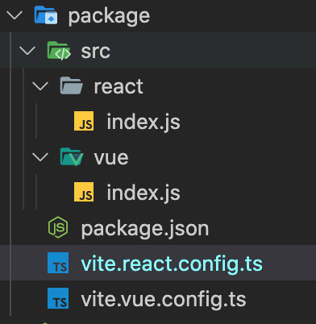

## 背景

最近工作中有一个功能需要做单独的组件进行发布，为了使得团队内多个项目能够使用，所以一开始便考虑使用 monorepo 的形式来开发兼容 vu2、vue3 和 react 的一个组件

考虑的 monorepo 组织形式大致为

```
┌─ yarn.lock
├─ examples
   ├─ react18
   ├─ vue2
   └─ vue3
├─ packages
└─ package.json
```

其中 viewer 目录就是要发布的功能，而 examples 下的项目需要依赖 viewer 项目来做示例的展示

在实现的过程中，遇到了非常多的坑，加上许多地方没有考虑清楚，导致在做的时候只能不停的换方向。接下来就实现一步一步的完成这个框架，解决遇到的大坑

比如：

- Yarn 如何添加本地依赖
- vue2、vue3 版本共存的问题
- 主要功能如何打包出能同时满足 vue 和 react 的问题

等等

## 搭建基础结构

首先我们要创建一个空目录，例如：`repo`，其次是需要思考我们要发布的功能的包名是什么，比如就叫`@my/create-repo`，这个名字就是 packages 下 package.json 文件的 name 字段

### 初始化主项目

现在首先来创建根目录下的`package.json`文件，并输入内容

```json
{
  "private": true,
  "workspaces": ["packages", "examples/*"]
}
```

然后创建`package`目录和`examples`目录，分别放我们的主目录和示例项目，并在`package`目录下执行

```bash
yarn init -y
```

并修改生成的`package.json`文件中的 name 字段为`@my/create-repo`

最后执行`yarn install`

这样就可以把 package 项目安装到根目录的依赖中，建立链接，后续示例项目在引用的时候可以直接 import 导入

### 初始化示例项目

在 examples 文件夹下面，通过 vite 快速创建 vue2、vue3 以及 react 项目

```bash
cd examples
yarn create vite vue2 --template vue
yarn create vite vue3 --template vue
yarn create vite react18 --template react
```

然后分别到各个项目目录下执行`yarn dev`来安装依赖并启动项目。

不过 vue2 项目下需要做修改，因为默认模版安装好之后依赖了 vue@3，而我们需要 vue@2

先修改`vue2/vite.config.ts`

```js
import { defineConfig } from "vite";
import { createVuePlugin } from "vite-plugin-vue2";

// https://vitejs.dev/config/
export default defineConfig({
  plugins: [createVuePlugin()],
});
```

将`@vitejs/plugin-vue`改成兼容 vue2 的`vite-plugin-vue2`。同时安装`vue-template-compiler`和`vue@2.7.10`

vite-plugin-vue2 也可以替换成`@vitejs/plugin-vue2`,不过仅支持`vue@^2.7.0`。所以 2.6 及以前的版本还是可以用`vite-plugin-vue2`

然后需要对项目代码做一些改造

首先在`APP.vue`中删除多余的根元素，因为 vue2 只允许一个根元素存在

其次修改入口文件`main.js`

```js
import Vue from "vue";
import "./style.css";
import App from "./App.vue";

new Vue({
  render(h) {
    return h(App);
  },
}).$mount("#app");
```

另外还存在一个问题，就是主空间依赖中的 vue 被共享了，使得 vue2 和 vue3 不能同时启动

在经过**数个小时**的搜索之后，并没有找到**如何在 workspace 中安装同一个包的不同版本**的解决办法。所以只能退而求其次，选择直接通过 CDN 的形式引入 Vue。

### 同时启动 vue2 和 vue3

首先需要将项目中所有用到 vue 的包当中执行卸载 vue 的动作，确保整个 workspace 中不再依赖 vue。

其次安装 CDN。

对于 vue2 项目，可以直接在 index.html 文件中添加`<script src="https://lib.baomitu.com/vue/2.7.7/vue.min.js"></script>`

CDN 添加以后，还需要做`externals`的处理，以保证在项目中还能正常的使用`import vue from vue`

在 viet 中，没有直接支持 externals 的功能，所以需要通过插件来完成，安装`vite-plugin-externals`。并修改配置文件

```js
import { defineConfig } from "vite";
import { createVuePlugin } from "vite-plugin-vue2";
import { viteExternalsPlugin } from "vite-plugin-externals";

export default defineConfig({
  plugins: [
    createVuePlugin(),
    viteExternalsPlugin({
      vue: "Vue", // 注意这里的值需要根据引入的包暴露在window上面的属性决定
    }),
  ],
});
```

这样 vue2 就算改造完成了

对于 vue3 项目，首先我们要找到支持 esm 的包，可以在`https://esm.sh`上找，比如:`https://esm.sh/vue@3.2.37?dev`。其中后面的 dev 表示开发模式，否则是没有热更新的

然后在`index.html`中通过`<script src="https://esm.sh/vue@3.2.37?dev" type="module"></script>`引入。

或者在配置文件中通过修改`alias`引入

```js
...
export default defineConfig({
    resolve:{
        alias: {
            vue: 'https://esm.sh/vue@3.2.37?dev'
        }
    }
})
```

推荐使用这种形式

安装好 CDN 以后发现 vue3 项目不能正常启动，会出现`Error: Failed to resile vue/compiler-sfc`的错误。这是因为我们刚才已经把 vue 全部卸载了的缘故

这个时候我们就需要安装`@vue/compiler-sfc`来补救，但是包虽然安装了，但错误还是依旧，因为始终没有找到`vue/compiler-sfc`包。

在经过有一番搜索之后，终于找到一个解决办法，在`devDependencies`中添加一条记录

```json
{
  "devDependencies": {
    "vue/compiler-sfc": "npm:@vue/compiler-sfc"
  }
}
```

通过 npm 映射关系来完成链接

或者直接通过如下形式进行关联，`yarn add vue/compiler-sfc@npm:@vue/compiler-sfc`

最后删除 node_modules，重新执行`yarn install`完成所有依赖的安装。至此 vue2 和 vue3 项目都能正常启动了

## 创建功能项目

vue 组件和 react 组件并不相同，因此采用 2 套代码和配置文件分别进行编译

文件结构大致如下：



由于编译采用 vite 进行，所以先来安装 vite

```bash
yarn add vite -D
```

`vite.vue.config.ts`的文件内容如下

```js
import { defineConfig } from "vite";
// for vue2 <= 2.6
import { createVuePlugin } from "vite-plugin-vue2";
// for vue >= 2.7
import vue2 from "@vitejs/plugin-vue2";
// for vue3
import vue3 from "@vitejs/plugin-vue";

export default defineConfig({
  plugins: [
    createVuePlugin(),
    // or
    vue2(),
    // or
    vue3(),
  ],
  build: {
    lib: {
      entry: "./src/vue/index.js",
      name: "MyRepo",
    },
    outDir: "dist/vue",
    rollupOptions: {
      external: ["vue"],
      output: {
        globals: {
          vue: "Vue",
        },
      },
    },
    watch: process.env.BUILD_ENV ? null : {},
  },
});
```

`vite.react.config.ts`内容如下：

```js
import { defineConfig } from "vite";

export default defineConfig({
  build: {
    lib: {
      entry: "./src/react/index.js",
      name: "MyRepo",
    },
    outDir: "dist/react",
    rollupOptions: {
      external: ["react"],
    },
    watch: process.env.BUILD_ENV ? null : {},
  },
});
```

最后在`package.json`中添加相应的脚本，来便捷的启动各自的编译任务

```json
{
  "scripts": {
    "build:vue": "vite --config vite.vue.config.ts build",
    "build:react": "vite --config vite.react.config.ts build",
    "build": "cross-env BUILD_ENV=true yarn build:vue && cross-env BUILD_ENV=true yarn build:react"
  }
}
```

生产环境中执行`build`命令即可在 dist 目录下生成`react`和`vue`的编译产物

### 关于如何导入

我希望在导入的时候可以直接通过类似`@my/create-repo/vue`和`@my/create-repo/react`即可得到相应语言的组件。但是现在所有的产物都在 dist 目录中，不能直接得到

我们可以通过`pakcage-exports`功能实现映射，可以查看[webpack-packages-exports](https://webpack.js.org/guides/package-exports/)或者[博客文章](https://www.cnblogs.com/taohuaya/p/15573719.html)来了解

总之我们需要修改我们的`package.json`为

```json
{
  "exports": {
    "./vue": {
      "import": "./dist/vue/create-repo.mjs",
      "require": "./dist/vue/create-repo.umd.js"
    },
    "./react": {
      "import": "./dist/react/create-repo.mjs",
      "require": "./dist/react/create-repo.umd.js"
    }
  }
}
```
