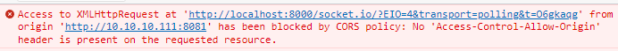

[socket.io](https://github.com/socketio/socket.io) 是 node 下一个非常著名的处理消息通信的包

## 安装

socket.io 的安装是非常简单的，

```bash
$ npm install socket.io
# 或者
$ yarn add socket.io
# 也可以使用pnpm
$ pnpm install socket.io

```

## 建立服务

在 socket.io 安装完成以后，就可以创建`server.js`文件来导入 socket.io，创建服务。基本流程与 net 模块非常相似

```js
const io = require('socket.io');

const server = io();

server.listen(8000);
console.log('server started, listen on port 8000');
```

启动服务，可以看到控制台打印出来的信息，表示服务启动成功了

<!-- more -->

## 客户端连接

之前通过 net 模块创建的 socket 服务，只能在 node 中连接，而 socket.io 支持 http 协议，所以我们可以通过编写一个 html 的方式来实现客户端

在文件中我们首先需要导入 socket.io 的 js 文件，地址是：`http://localhost:8000/socket.io/socket.io.js`

可以看到请求地址就是刚才我们启动的 8000 服务，这个就是 socket.io 本身提供给我们客户端使用的

```html
<body>
  <script src="http://localhost:8000/socket.io/socket.io.js"></script>
</body>
```

创建客户端 socket 实例

```html
<script>
  const client = io.connect('localhost://8000');
  client.on('wellcome', (data) => {
    console.log(data);
  });
</script>
```

通过 socket 传递消息是非常方便的，他允许我们自定义事件，如上我们定义了一个`wellcome`的事件，我们就可以在服务端中收到一个新的连接的时候来触发

## server 端发送消息

回到`server.js`文件

```js
server.on('connection', (socket) => {
  socket.emit('wellcome', 'hello');
});
```

如果访问的时候出现跨域的问题



只需要修改一下 socket 的配置

```js
const server = io({ cors: true });
```

## 客户端退出

在 socket.io 中监控客户端退出是非常容易的，只需要在 socket 对象上添加`disconnect`事件即可

```js
socket.on('disconnect', () => {
  console.log('客户端退出');
});
```

## 与 http 协同

往往我们的服务并不是单纯的只提供 socket，还包括其他的交互，这些交互往往都是通过 http 来实现的，那如何在一个服务中即包括 http，又包括 socket 呢

方法非常简单，在现有的 server 的基础上，只需要改变一下创建 socket 的方式即可

```js
const http = require('http');
const httpServer = http.createServer();
const server = io(httpServer, { cors: true });
httpServer.listen(8000);
```

注意，这里监听端口的服务是**httpServer**

同样的，如果我们的服务是通过 express 编写的，那么可以修改为如下形式

```js
const express = require('express');
const app = express();
const httpServer = http.createServer(app);
const server = io(httpServer, { cors: true });
httpServer.listen(8000);
```

总结下来，就是 http，只需要在创建 socketServer 的时候传入 httpServer 对象即可

```js
const app = require('express')();
const http = require('http').Server(app);
const io = require('socket.io')(http);

app.get('/', (req, res) => {
  console.log(req.url);
  res.send('hello');
});

io.on('connect', (socket) => {});

http.listen(8000);
```

更加详细的用法，可以查看[官网](https://socket.io/docs/v4/server-initialization/)的示例
