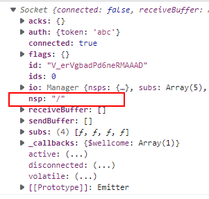

通过使用命名空间，可以节省内存资源的占用，一个命名空间可以包含多个 room

## 命名空间的使用

socket 连接以后会有一个默认的命名空间，通过`client.nsp`可以查看到



## 如何创建一个命名空间

在此前的示例中，我们都是通过`io`方法直接创建了一个 socketServer，由此生成了一个默认的命名空间

创建新的命名空间也非常简单，只需要通过刚才创建出来的 socketServer 上的 of 方法，就可以创建一个与默认命名空间一样的 socketServer 对象。并且这个与默认命名空间的 server 完全一致，拥有相同的方法与事件

<!-- more -->

```js
// 创建默认命名空间
const socketServer = io(httpServer, {
  cors: true,
});

const nspSocketServer = socketServer.of('/room1');
nspSocketServer.on('connection', (socket) => {
  socket.emit('wellcome', 'hello, this is room1');
});
```

回到客户端，将连接的地址改为`http://localhost:8080/room1`

```js
const client = io.connect('http://localhost:8000/room1');
client.on('wellcome', (data) => {
  console.log(data);
});
```


这样就连接上了带命名空间的 socket 服务了

## 房间操作

房间操作涉及到加入和离开，

- 加入房间，调用`socket.join`方法传入一个 roomId 就可以
- 离开房间，调用`socket.leave`方法传入一个 roomId 就可以

在加入房间之前，我们打印`socket.adapter.rooms`，可以看到当前的 socket 的房间信息如下：`Map(1) { 'rk_k1-GUsX4feRatAAAB' => Set(1) { 'rk_k1-GUsX4feRatAAAB' } }`

在加入一个房间之后`socket.join('1123')`再次打印：`Map(2) { 'rk_k1-GUsX4feRatAAAB' => Set(1) { 'rk_k1-GUsX4feRatAAAB' }, '1123' => Set(1) { 'rk_k1-GUsX4feRatAAAB' } }`

可以看到多了一个房间号的信息

## 发送房间消息

socket 在连接到服务器以后，我们可以直接通过`socket.emit`来向客户端发送消息，但是这个消息只是服务端与客户端的消息，而不是房间内的消息

发送房间内的消息也非常简单

```js
const roomId = '1123';
nspSocketServer.to(roomId).emit('wellcome', '欢迎进入1123号房间');
```

客户端就收到了这一条消息，完整的代码如下：

```js
const nspSocketServer = socketServer.of('/room1');
nspSocketServer.on('connection', (socket) => {
  const roomId = '1123';
  socket.join(roomId);
  const roomId2 = '1124';
  socket.join(roomId2);
  // 服务端连接成功
  socket.emit('wellcome', 'hello, this is room1');
  // 房间欢迎语
  nspSocketServer.to(roomId).emit('wellcome', '欢迎进入1123号房间');
});
```
