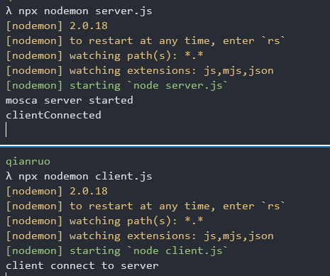
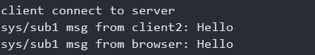
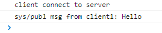
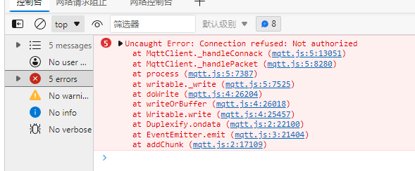

## 评价标准

消息推送有许多的方案，比如长轮询、短轮训等。如何评价一个方案呢，目前采用`4S`标准，即：

- 安全(safe)：安全性
- 稳定(Stable)：同时在线、高并发的延迟、高可用（断线重连）
- 节省(Save)：对于客户端主要是两个指标，功耗以及流量消耗
- 体积小(Slim)

## 推送方式

- HTTP 推送：包括长轮询、短轮训、WebSocket
- XMPP 拦截
- SMS 拦截
- MQTT（物联网采用的方式）

## MQTT

MQTT(Message Queueing Telemetry Transport)消息队列遥测传输，是 IBM 开发的一个即使通信协议。有可能成为物联网重要组成部分，该协议支持所有平台，几乎可以把所有联网物品和外部连接起来，被用来当做传感器和致动器的通信协议

<!-- more -->

### MQTT 的特点

- MQTT 采用发布订阅的模式，提供一对多的消息发布，解除应用程序的耦合

- 对负载内容屏蔽的消息传输

- 基于 TCP/IP 的网络协议

- 三种消息发布质量：至多一次、至少一次、只有一次
- 小型传输，开销很小（头部固定 2 个字节），协议交换最小化，以降低网络流量
- 使用 Last Will 和 Testament 特性通知有关各客户端异常终端的机制

相关参考:

- [mqtt 官网](https://mqtt.org/)
- [中文资料](https://github.com/mcxiaoke/mqtt)、[对应文档](https://mcxiaoke.gitbook.io/mqtt/)

在 Node 平台下，我们将使用[mqtt.js](https://github.com/mqttjs/MQTT.js)以及[mosca](https://github.com/moscajs/mosca)

#### mosca

mosca 是 Mqtt 的一个代理，通过它我们可以在 node 上运行 mqtt Server，通过`npm install mosca`来安装。mosca 本身不具备集群的功能，如果要扩展，需要借助第三方的库，如 Redis、Mongodb、ZeroMQ 等

Events

- ready
- error
- published
- subscribed
- unsubscribed
- clientConnected
- clientDisconnected

安装好 mosca 之后，我们来创建第一个服务，`touch server.js`

```js
const mosca = require('mosca');

const settings = {
  port: 8957,
};

const server = new mosca.Server(settings);

server.on('ready', () => {
  console.log('mosca server started');
});
```

这样 mqtt 服务就启动好了，接下来我们就要去实现客户端，为了能够在服务端看到客户端的连接，我们再添加一个`clientConnected`事件。

```js
server.on('clientConnected', (client) => {
  console.log('clientConnected');
});
```

客户端的实现使用 mqtt 包

```js
const mqtt = require('mqtt');

const client = mqtt.connect('mqtt://localhost:8957');

client.on('connect', () => {
  console.log('client connect to server');
});
```

现在启动客户端和服务端就能看到控制台的消息了



##### 收发消息

之前说了 mosca 只是 mqtt 的一个代理，不会处理消息本身，为了完成收发消息，我们分别在两个客户端上分别实现，代码分别如下:

```js
// client1.js
const mqtt = require('mqtt');

const client = mqtt.connect('mqtt://localhost:8957');
const pubTopic = 'sys/pub1';
const subTopic = 'sys/sub1';

client.on('connect', () => {
  console.log('client connect to server');

  client.subscribe(subTopic);

  client.publish(pubTopic, 'msg from client1: Hello');
});

client.on('message', (topic, msg) => {
  console.log(topic, msg.toString());
});
```

```js
// client2.js
const mqtt = require('mqtt');

const client = mqtt.connect('mqtt://localhost:8957');
const subTopic = 'sys/pub1';
const pubTopic = 'sys/sub1';

client.on('connect', () => {
  console.log('client connect to server');

  client.subscribe(subTopic);

  setTimeout(() => {
    client.publish(pubTopic, 'msg from client2: Hello');
  }, 10000);
});

client.on('message', (topic, msg) => {
  console.log(topic, msg.toString());
});
```

注意每个客户端对应的发布和订阅 channel 的对应关系

##### 在浏览器中使用

首先需要修改 server.js 的 settings 参数

```js
const settings = {
  port: 8957, // 提供给nodejs的客户端调用
  http: {
    port: 8956,
    bundle: true, // 向客户端提供对应的bundle文件
  },
};
```

而在客户端，也需要使用 mqtt 模块来连接上服务，在 server 的 settings 中，我们已经添加了字段`http.bundle: true`，意味着我们可以通过这个端口获取对应的包

```html
<script src="http://localhost:8956/mqtt.js"></script>
```

拿到模块以后，接下来的事情和在 node 平台下作的没有区别

```html
<script>
  const client = mqtt.connect('mqtt://localhost:8956');

  const subTopic = 'sys/pub1';
  const pubTopic = 'sys/sub1';

  client.on('connect', () => {
    console.log('client connect to server');

    client.subscribe(subTopic);

    setTimeout(() => {
      client.publish(pubTopic, 'msg from browser: Hello');
    }, 10000);
  });

  client.on('message', (topic, msg) => {
    console.log(topic, msg.toString());
  });
</script>
```

仔细观察这部分，相对于 client2 文件，其实只修改了很少的部分，首先是连接的端口，修改成了 http 配置下端口，另外则是将 pub 出去的消息修改为了`from browser`，这样我们在 client1 的控制台就能看到



以及在浏览器的控制台看到



#### 主题树

我们在订阅 topic 的时候，需要与 publish 的 topic 完全一致才能够接收到消息，比如：

```js
client.subscribe('node1/node2/node3');

client.subscribe('node1/node2/node3', 'test');
```

这样 client 就能在 message 事件中接收到消息了。

另外一种订阅消息的方式是通过通配符来进行匹配，通配符有 2 种，一种用`#`表示，一种用`+`号表示,它们的区别如下:

`client.subscribe('node1/node2/+')`可以匹配的 channel 如下:

- node1/node2/
- node1/node2/node3

但是不能匹配`node/node2`、`node1/node2/node3/`，也就是说/后面的+表示的是此后不能再出现`/`

另一种`client.subscribe('node1/node2/#')`可以匹配的 channel 如下:

- node1/node2
- node1/node2/
- node1/node2/node3
- node1/node2/node3/
- node1/node2/node3/node4

可以看到`#`的匹配比`+`宽松许多

#### ACL

ACL 全称 Access ControlList，访问控制列表，RBAC 则是更高层次的一个封装，在 mosca 中主要通过 acl 来进行基于用户的访问控制，提供了一个`Authorizer`方法，可以控制用户的访问，也可以控制用户能够发布哪些主题，订阅哪些主题

首先在 server 中创建一个 auth 模块出来

```js
const auth = new mosca.Authorizer();
const authenticate = auth.authenticate;
const authenticatePublish = auth.authenticatePublish;
const authenticateSubscribe = auth.authenticateSubscribe;
```

接着就是在 server 的 ready 事件发生的时候，将模块添加到 server 上

```js
server.on('ready', () => {
  server.authenticate = authenticate;
  server.authenticatePublish = authenticatePublish;
  server.authenticateSubscribe = authenticateSubscribe;
});
```

此时我们再通过客户端去访问，将得到这样的错误



将用户添加到白名单中也很简单，调用`auth.addUser`即可，移除用户可以调用`rmUser`

```js
auth.addUser('username', 'password', (err) => {
  if (err) {
    console.log('add user fail');
  } else {
    console.log('add user success');
  }
});

auth.rmUser('username', () => {});
```

然后再去修改客户端的连接方式，将用户名密码带过去

```js
const client = mqtt.connect('mqtt://localhost:8956', {
  username: 'username',
  password: 'password',
});
```

这样就可以正常访问了

另外基于主题的发布和订阅控制，主需要在`addUser`的时候传递第三个参数和第四个参数，

```js
auth.addUser('username', 'password', 'sys/*', 'sub/*', (err) => {});
```

这样，这个用户就只能发布 sys 的主题，订阅 sub 的主题

自定义的权限校验，可以自己手动实现 authenticate 的功能

```js
server.authenticate = (client, username, password, callback) => {
  callback(null, false); // 权限不通过
  callback(null, true); // 权限通过
};

server.authenticatePublish = (client, topic, payload, callback) => {
  callback(null, false); // 不允许发布
  callback(null, true); // 允许发布
};

server.authenticateSubscribe = (client, topic, callback) => {
  callback(null, false);
  callback(null, true);
};
```
