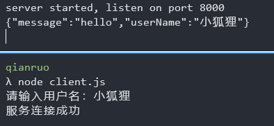
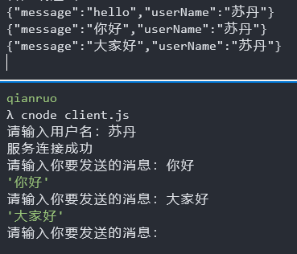

## 前言

基于前面两篇的内容，我们现在已经能够实现一个极简易的控制台聊天室。它的功能非常简单，在控制台启动服务端之后，通过其他控制台，打开客户端，能够彼此收发消息。下面就开始相关逻辑的编写

## 第一步，编写基础的逻辑

与前面两节一样，我们先实现一个基本的连接事件

::: details server 端

```js
const net = require('net');

const server = net.createServer();
const socketSets = new Set();
server.on('connection', function(socket) {
  // 连接成功的时候保存socket
  socketSets.add(socket);
  socket.on('data', (msg) => {
    // 客户端发送消息
    console.log(msg.toString());
  });
});

server.listen(8000, () => {
  console.log('server started, listen on port 8000');
});
```

:::

<!-- more -->

这里选择 set 结构，是因为相比数组，能更好的对集合进行迭代和删除等操作

::: details client 端

```js
const net = require('net');
const socket = net.connect({ port: 8000 });

socket.on('connect', () => {
  console.log('服务连接成功');

  socket.write('hello');
});

socket.on('data', (msg) => {
  console.log(msg);
});
```

:::

这样，就实现了一个基础的结构，每当有一个 client 连接进来的时候，都会在 server 端的控制台下打印一个 Hello。

下面来继续填充逻辑，我们已经在每一个 client 连接进来的时候，将其收集起来了，因此要实现聊天室的功能，只需要在每一个客户端发送消息的时候，将其发送给其他所有的客户端就可以了。

但现在，面临的问题是，如何在控制台自由的输入文本

## repl

nodejs 提供了[repl](http://nodejs.cn/api/repl.html#replstartoptions)模块，可供在代码中调用终端的输入功能

先来看看`repl`的基本使用

::: details repl

```js
const repl = require('repl');

const instance = repl.start({
  eval(cmd, ctx, filename, callback) {
    callback(null, cmd);
  },
});
```

:::

其中`eval`就是我们处理输入的主要方法，默认值是 js 的 eval 方法。


## 实现 client 的交互

现在我们已经能够在控制台进行简单的交互了， 同时，为了使得每一条消息中都带有发送者的信息，因此，我们在创建 client 之前，需要先输入一个用户名。在这里我们就采用简单的一点的实现方式

::: details 输入用户名提示

```js
const readline = require('readline');
const rl = readline.createInterface({
  input: process.stdin,
  output: process.stdout,
});

rl.question('请输入用户名：', (answer) => {
  rl.close();
  console.log(answer);
  process.exit(0);
});
```

:::

在拿到用户名之后，就要创建连接了，我们将之前写的 socket 的处理封装到一个函数中，方便在拿到用户名之后直接调用。因此现在大致代码如下：

```js
const net = require('net');
const readline = require('readline');

let client = null;
let userName = null;

const createSocket = () => {
  const socket = net.connect({ port: 8000 });
  socket.on('connect', () => {
    console.log('服务连接成功');
    socket.write('hello');
  });

  socket.on('data', (msg) => {
    console.log(msg);
  });

  return socket;
};

const rl = readline.createInterface({
  input: process.stdin,
  output: process.stdout,
});

rl.question('请输入用户名：', (answer) => {
  rl.close();
  userName = answer;
  client = createSocket();
});
```

可以看到 client 是作为全局变量的存在，主要是为了方便方法的调用，比如我们现在创建一个发送消息的方法

```js
function send(message) {
  lient.write(
    JSON.stringify({
      message,
      username,
    })
  );
}
```

现在我们就只需要调用 send 方法，就可以直接发送消息了，修改一下 connect 事件中的默认消息，将他改为由 send 发送

```js
socket.on('connect', () => {
  console.log('服务连接成功');
  send('hello');
});
```

效果如下：



现在，就可以来实现发送消息的功能了，我们可以直接将上一步的 repl 功能封装到函数中，同样的，在 connect 事件发生的时候来调用

```js
function createRepl() {
  repl.start({
    prompt: '',
    eval(cmd, ctx, filename, callback) {
      const message = cmd.trim();
      callback(null, message);
    },
  });
}
socket.on('connect', () => {
  console.log('服务连接成功');
  send('hello');
  createRepl();
});
```

接着要做的就是在 eval 函数中，得到输入值之后将他发送出去，这里我们就可以直接调用 send 方法

```js
eval(cmd, ctx, filename, callback) {
  const message = cmd.trim()
  send(message)
  callback(null, message);
}
```

效果如下：



## server 端修改

现在 client 端已经可以发送消息了，多个 client 端都没关系，不过多个 client 端之间还无法通信，我们还要来实现一下 server 端，让他能够正常的去推送消息

修改 server.js 中对 socket 的 data 事件为如下代码

```js
socket.on('data', (msg) => {
  // 客户端发送消息
  const message = msg.toString();
  console.log('server端收到消息', message);
  socketSets.forEach((client) => {
    if (client !== socket) {
      client.write(msg);
    }
  });
});
```

这样在客户端就能收到其他人发的消息啦。最后我们调整一下客户端收到的消息的格式

```js
socket.on('data', (msg) => {
  const { userName, message } = JSON.parse(msg.toString());

  console.log(`${userName}: ${message}`);
});
```

## 总结

最终实现下来，整个程序还是有一些瑕疵，比如，如何使得 prompt 提示与其他人发送的消息能够更清晰的分开。
