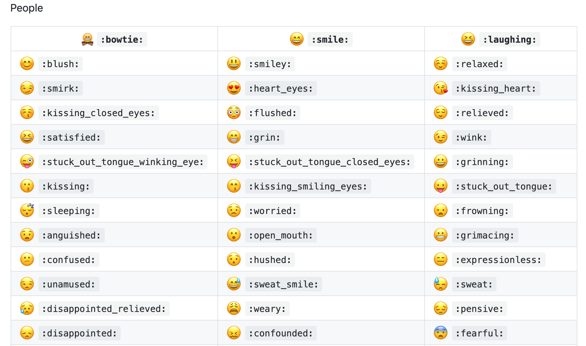

## :hammer_and_wrench: inquirer

**工具** 常用交互式命令行用户界面的集合。[https://github.com/SBoudrias/Inquirer.js#documentation](https://github.com/SBoudrias/Inquirer.js#documentation)

就像是这样，

## :gift: emoji

**好玩** emoji代码，可以用于markdown编辑

[https://gist.github.com/rxaviers/7360908](https://gist.github.com/rxaviers/7360908)

[https://api.github.com/emojis](https://api.github.com/emojis)

[https://www.webfx.com/tools/emoji-cheat-sheet/](https://www.webfx.com/tools/emoji-cheat-sheet/)

[git commit使用emoji指南](https://github.com/liuchengxu/git-commit-emoji-cn)

[实用规范](https://gitmoji.carloscuesta.me/)

[emoji对应Unicode](https://apps.timwhitlock.info/emoji/tables/unicode)

[search emoji](https://emojipedia.org/)

