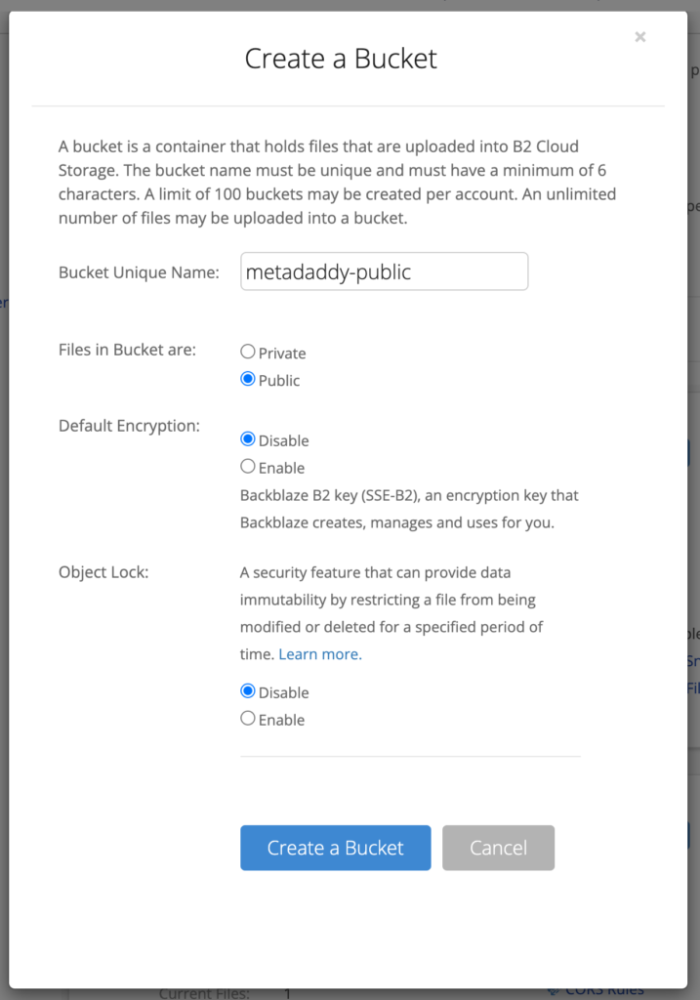
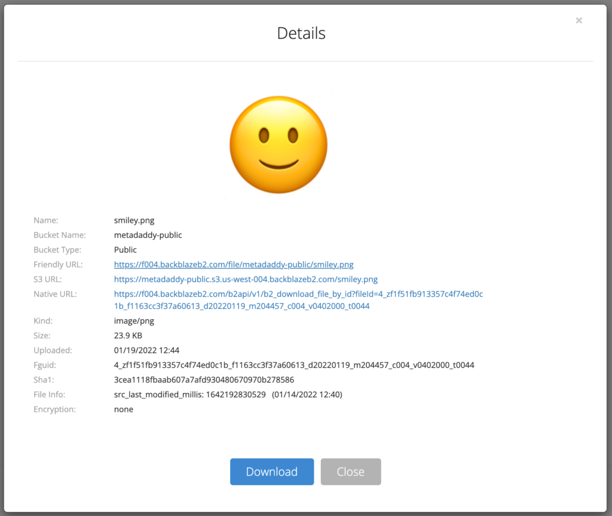
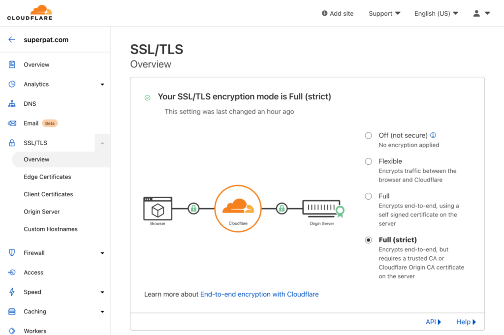
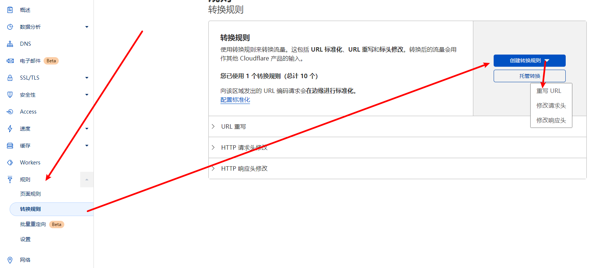
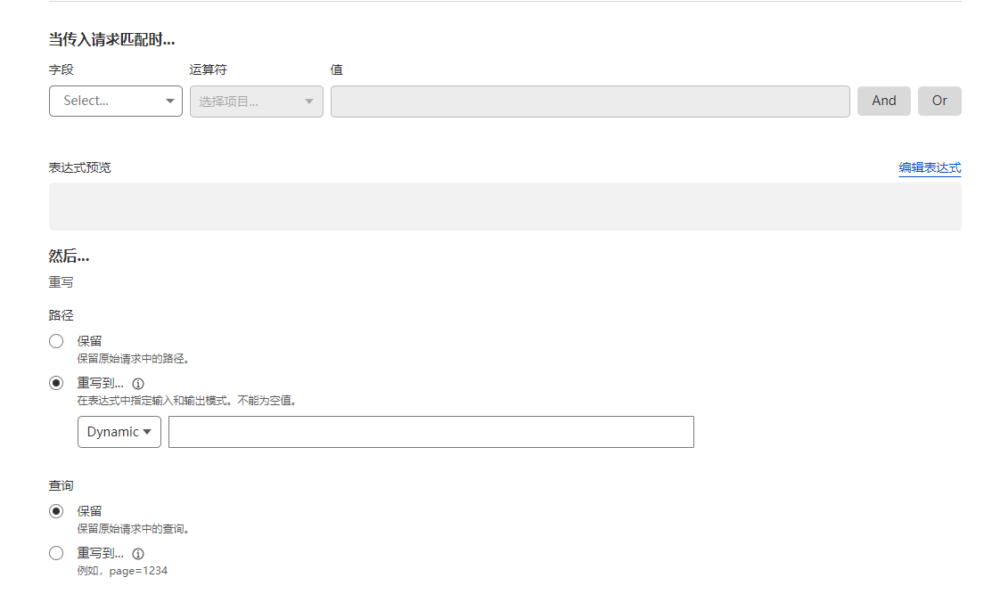

## 准备工作

首先需要具有以下的一些账号

- 域名，交由 cloudflare 管理
- [cloudflare](https://dash.cloudflare.com/)账号
- [backblaze](https://secure.backblaze.com/)账号

## 创建 bucket

前往[bucket](https://secure.backblaze.com/b2_buckets.htm)，点击 create a bucket 按钮，创建一个 bucket



然后点击 Upload/Download，随便上传一个文件到你的 bucket 中。上传完成以后就可以看到这个图片的具体信息



注意其中的`Friendly URL`，这个就是我们要用的链接。比如：`https://f004.backblazeb2.com/file/metadaddy-public/smiley.png`

接下来我们就要利用 cloudflare 代理这个图片地址

## 创建 DNS

前往 Cloudflare 的[dash](https://dash.cloudflare.com/)页面，来到域名的 DNS 页面创建一条 CNAME 记录，解析值为`f004.backblazeb2.com`

比如：`img.example.com` CNAME 解析到`f004.backblazeb2.com`

默认情况下，可能会出现访问失败，我们需要打开域名的 https 完整支持。



现在我们就可以通过`https://img.example.com/file/metadaddy-public/smiley.png`来访问到刚才的图片了

## 链接转换

在 cloudflare 的页面转换中添加一条重写 URL 规则，



创建规则



**字段名选择主机名，预算符选择等于，值填入域名`img.example.com`。点击后面的 and**

再添加一条记录

**字段名选择 URL 路径，运算符选择不包含，值填入要忽略的路径`/file/metadaddy-public`**

也可以点击编辑表达式按钮，输入

```
not starts_with(http.request.uri.path, "/file/metadaddy-public")
或者
(http.host eq "img.bianqu.cf" and not http.request.uri.path contains "/file/blog-images-public")
```

意思是如果请求的链接地址不是以`/file/metadaddy-public`，都将应用这条规则

然后重写地址，在 dynamic 中输入

```
concat("/file/metadaddy-public", http.request.uri.path)
```

意思是将`/file/metadaddy-public`拼接到请求地址的前面

保存之后，就可以通过`https://img.example.com/smiley.png`来访问之前的图片了
