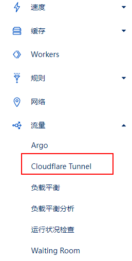

这里说的 Tunnel 是 CloudFlare 的 Argo Tunnel Client 产品，可以将本地服务发布到 cloudflare，其原理类似 frp。只不过 frp 所需的服务器 IP 在 Argo Tunnel 中变成了 Cloudflare 提供的节点。相比运营商公网 IP，Argo Tunnel 省去了跟运营商扯皮的时间，相比于 frp 则省去了服务器的成本。

## 准备工作

首先要在 Cloudflare 中开通此服务，随便点击一个域名，在左侧导航找到`流量 > Cloudflare Tunnel`，进去之后根据提示开通即可



## 环境安装

在官方的[github 仓库](https://github.com/cloudflare/cloudflared/releases)，找到对应环境的包进行下来并且安装，例如 Ubuntu：

```bash
wget https://ghproxy.com/https://github.com/cloudflare/cloudflared/releases/download/2022.7.1/cloudflared-linux-amd64.deb
dpkg -i cloudflared-linux-amd64.deb
```

检测一下是否安装成功

```bash
$ cloudflared -v
```

## 登录

Argo Tunnel Client 需要使用者登录 Cloudflare 账号以进行授权，执行

```bash
$ cloudflared tunnel login
```

控制台会输出一个地址，复制到浏览器打开进行授权

## 创建 tunnel

在控制台输入

```bash
cloudflared tunnel create [tunnel name]
```

如果创建成功，会输出一个 UUID，并在`~/.cloudflared`目录下创建一个已 UUID 为文件名的 json 文件

## 配置 DNS 记录

回到 cloudflare 的 dashboard，添加一条 CNAME 记录。解析值为`[UUID].cfargotunnel.com`

> 注意：解析记录的域名需要与授权的域名一致

## 创建配置文件

在`~/.cloudflared`目录下创建一个`config.yml`文件，内容如下

```yml
tunnel: [tunnel 的名称或 UUID]
credentials-file: /root/.cloudflared/[tunnel 的 UUID].json

ingress:
  - hostname: [CNAME 记录名称].[接入 CLoudflare 的域名]
    service: http://localhost:80
  - service: http_status:404
```

可以在 ingress 下创建多个记录，查看[文档](https://developers.cloudflare.com/cloudflare-one/connections/connect-apps/configuration/local-management/ingress/)

## 启动服务

```bash
cloudflared tunnel --config /root/.cloudflared/config.yml run
```

如果不指定配置文件路径，cloudflared 会默认读取 ~/.cloudflared/config.yml，在浏览器中打开解析的 dns，如果能够访问，就表示配置成功了

## 配置为系统服务

执行

```bash
cloudflared service install
```

cloudflared 会新建 systemd 文件，其他系统可以查看[文档](https://developers.cloudflare.com/cloudflare-one/connections/connect-apps/run-tunnel/as-a-service/)

```bash
systemctl start cloudflared
systemctl status cloudflared
systemctl restart cloudflared
```

通过`systemctl status cloudflared`可以看到此时配置文件为`/etc/cloudflared/config.yml`

```bash
● cloudflared.service - cloudflared
     Loaded: loaded (/etc/systemd/system/cloudflared.service; enabled; vendor preset: enabled)
     Active: active (running) since Mon 2022-07-11 21:23:05 CST; 27min ago
   Main PID: 986977 (cloudflared)
      Tasks: 10 (limit: 9316)
     Memory: 10.4M
     CGroup: /system.slice/cloudflared.service
             └─986977 /usr/bin/cloudflared --no-autoupdate --config /etc/cloudflared/config.yml tunnel run

Jul 11 21:23:04 nas cloudflared[986977]: 2022-07-11T13:23:04Z INF Settings: map[config:/etc/cloudflared/config.yml cred-file:/root/.cloudflared/e684dbfd-d511-44c6-aabc-9f0e7c54e069.json credentials-file:/root/.cloudflared/e684dbfd-d511>
Jul 11 21:23:04 nas cloudflared[986977]: 2022-07-11T13:23:04Z INF cloudflared will not automatically update if installed by a package manager.
Jul 11 21:23:04 nas cloudflared[986977]: 2022-07-11T13:23:04Z INF Generated Connector ID: 5aff6210-436b-4f8f-956f-820d5487bb7c
Jul 11 21:23:04 nas cloudflared[986977]: 2022-07-11T13:23:04Z INF Initial protocol quic
Jul 11 21:23:04 nas cloudflared[986977]: 2022-07-11T13:23:04Z INF Starting metrics server on 127.0.0.1:38243/metrics
Jul 11 21:23:05 nas cloudflared[986977]: 2022-07-11T13:23:05Z INF Connection 795e1d45-0d0b-403e-bf8d-baeaac82a7a8 registered connIndex=0 ip=198.41.200.63 location=SJC
Jul 11 21:23:05 nas systemd[1]: Started cloudflared
```

所以此后修改配置之后需要将文件复制到`/etc/cloudflared/config.yml`，也可以在`/etc/systemd/system/cloudflared.service`文件中修改配置文件的地址

最后执行重启`systemctl restart cloudflared`。
