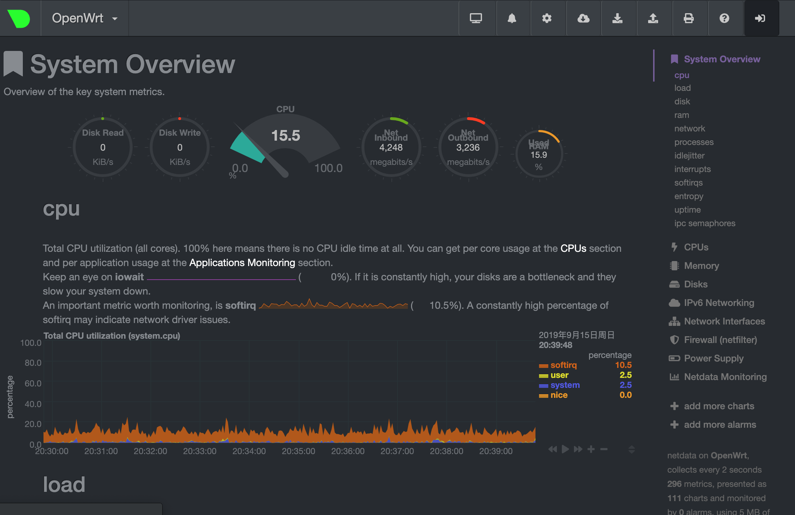

## 编译

编译采用的Lean的源[github](https://github.com/coolsnowwolf/lede)，按照步骤基本能编译成功，要注意编译环境需要保证40-50G的空间。

h3编译:

- Target System选择Allwinner A1x/A20/A3x

- Subtarget选择Allwinner A20/A3x

- Target Profile选择FriendlyARM NanoPi NEO

[参考](https://blog.csdn.net/wb4916/article/details/78227022)

我主要用到的几个额外的包的github地址

```bash
# aliddns
git clone https://github.com/honwen/luci-app-aliddns.git

# baidupcs-web
git clone https://github.com/KFERMercer/openwrt-baidupcs-web.git
git clone https://github.com/KFERMercer/luci-app-baidupcs-web.git

# 解锁网易云音乐
git clone https://github.com/maxlicheng/luci-app-unblockmusic

# ssr-plus
# 用的leo大的魔改版

# 主题
git clone https://github.com/openwrt-develop/luci-theme-atmaterial.git
```

## 安装

我选择的安装环境的virtualbox，网页[下载](https://www.virtualbox.org/wiki/Downloads)virtualBox及其Extension Pack。或者备用[下载](http://download.virtualbox.org/virtualbox/)

所以需要编译出来vdi格式的虚拟机格式。如果嫌编译之后的空间小，可以修改

> Target Image -> Root filesystem partition size 选项（一般情况下是倒数第二个）

还是那句话，修改这一项要注意编译空间的大小

如果使用的是别人提供的固件，也就是一个img格式的文件，可以在安装完成virtualBox之后在命令行下转换

```bash
VBoxManage convertfromraw --format VDI openwrt-x86-64-combined-squashfs.img openwrt-x86-64-combined-squashfs.vdi    
```

如果报错，用dd命令重新整合一下，[参考](https://openwrt.org/zh/docs/guide-user/virtualization/virtualbox-vm)

> dd if=openwrt-x86-64-combined-squashfs.img of=openwrt.img bs=128000 conv=sync

- 创建虚拟机

选择刚才生成的vdi文件，这一步网上都有教程。在设置中添加网卡，选择桥接模式，高级设置中混杂模式改为全部允许。

添加一块额外的vdi磁盘

- 启动虚拟机

大概一分钟启动好了之后，通过`vi /etc/config/network`修改lan口地址。

这样基本就安装好了

## 配置

### 挂载硬盘

参考这一篇[文章](https://blog.csdn.net/xiexievv/article/details/50525783)，将多添加的磁盘挂载到虚拟机

### 联网

在`网络 > 接口`下选择wan口，进行拨号上网，lan口不需要太多的设置

如果不能上网，在`网络 > 防火墙 > 自定义规则`下添加`iptables -t nat -I POSTROUTING -j MASQUERADE`

### aliddns

使用aliddns的一个前提是拨号需要得到一个公网IP，没有公网IP就放弃吧，改用frp

购买阿里云域名之后，还需要创建Access Key ID。

### SSR plus + 

看指示就行，运行模式选择GFW就行，解析模式选则dnsforwarder UDP

### netdata

一般固件内没有包含，需要手动安装

```bash
opkg install netdata
```

安装完成之后打开端口19999端口查看

看上去就像这样



### aria2配置

附加选项添加一项，`check-certificate=false`，用户组选择root用户，任务设置中`单服务器最大链接数`填13。

bt配置，[tracker list](https://newtrackon.com/list)，[trackerslist](https://github.com/ngosang/trackerslist)。加快下载速度

如果下载不了，就重启一下aria2。在`系统 -> 启动项`中选择重启，或者在命令行中执行`arai2c -c --conf-path=/tmp/etc/aria2/aria2.conf.main`

参考橘子大神的[视频](https://www.youtube.com/watch?v=nMIVGr_mhQg&t=1428s)

### acc网络加速

在[地址](https://www.shurouwang.com/article/214.html)获取

上游DNS`114.114.114.114,114.114.115.115,114.114.114.119,114.114.115.119,114.114.114.110,114.114.115.110,223.5.5.5,223.6.6.6,180.76.76.76,101.198.198.198,101.198.199.200,119.29.29.29,119.28.28.28,182.254.118.118,182.254.116.116,1.2.4.8,210.2.4.8,117.50.11.11,117.50.22.22,117.50.10.10,117.50.20.20,101.226.4.6,218.30.118.6,123.125.81.6,140.207.198.6,202.141.162.123,202.141.178.13,202.38.93.153,202.141.176.93,101.132.183.99,193.112.15.186,63.223.94.66,123.206.61.167,119.29.105.234,101.236.28.23,120.77.212.84,123.207.137.88,115.159.220.214,115.159.146.99,123.206.21.48,101.6.6.6,40.73.101.101,115.159.154.226,47.99.165.31,182.254.242.15,101.101.101.101,101.102.103.104,203.80.96.10,203.80.96.9,202.55.11.100,202.55.21.85,112.121.178.187,168.95.192.1,168.95.1.1,202.45.84.58,1.1.1.1,1.0.0.1,176.103.130.130,176.103.130.131,176.103.130.132,176.103.130.134,8.8.8.8,8.8.4.4,4.2.2.1,4.2.2.2,9.9.9.9,8.26.56.26,8.20.247.20,199.91.73.222,178.79.131.110,208.67.222.222,208.67.220.220,208.67.222.123,208.67.220.123,156.154.70.1,156.154.71.1,199.85.126.10,199.85.127.10,64.6.64.6,64.6.65.6,216.146.35.35,216.146.36.36,80.80.80.80,80.80.81.81,77.88.8.8,77.88.8.1,77.88.8.8,77.88.8.2,77.88.8.7,77.88.8.3,103.197.104.178,103.197.106.75,203.189.136.148,74.82.42.42,66.220.18.42,203.112.2.4,84.200.69.80,84.200.70.40,195.46.39.39,195.46.39.40,109.69.8.51,168.126.63.1,168.126.63.2,168.126.63.1,168.126.63.2,210.220.163.82,219.250.36.130,164.124.101.2,203.248.252.2,164.124.107.9,203.248.242.2,207.148.107.4,185.222.222.222,185.184.222.222`

### 可道云

### JetBrains 授权服务器


更多[参考](https://www.mivm.cn/?s=openwrt)


