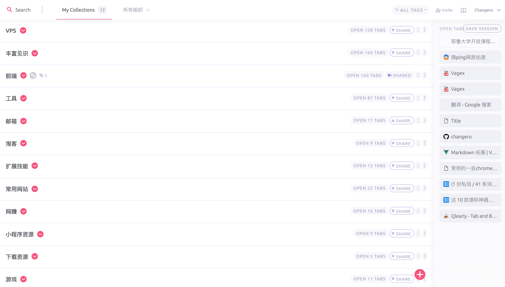
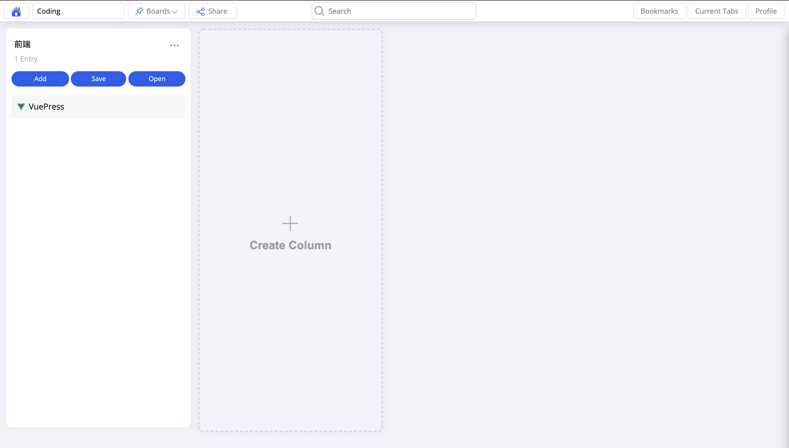
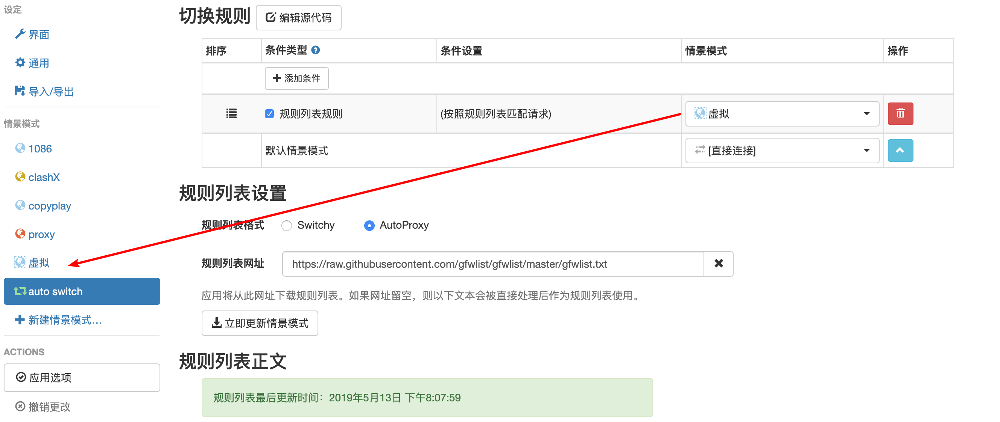
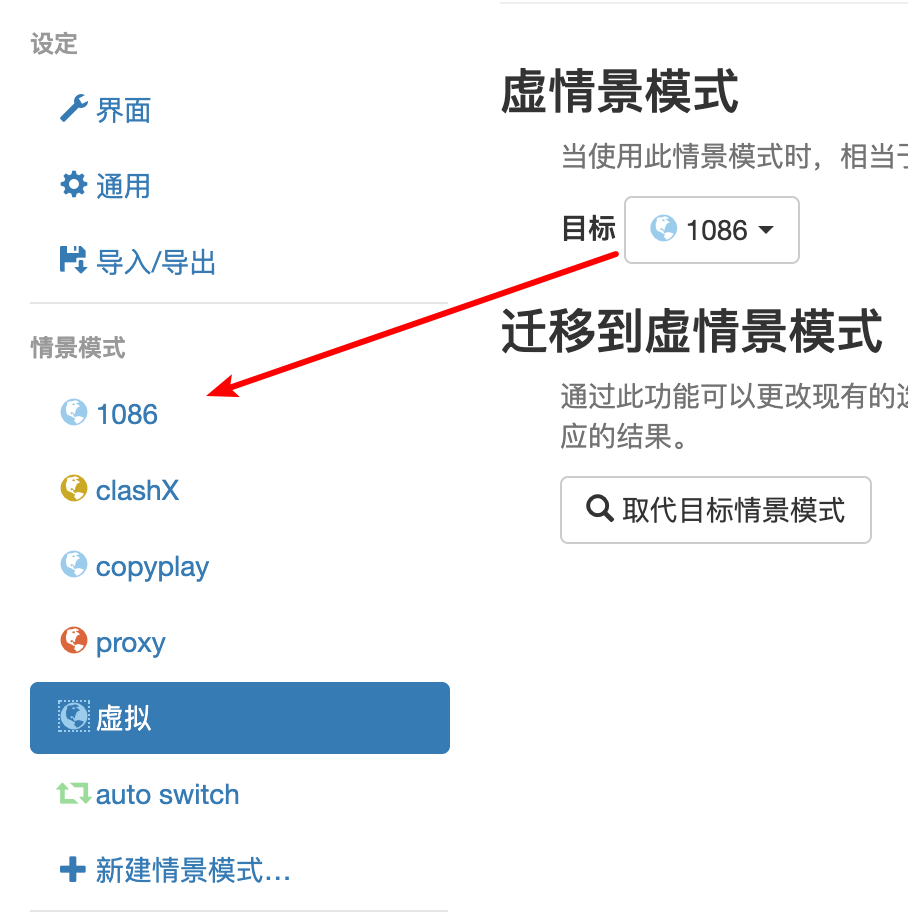
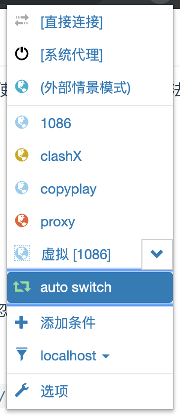
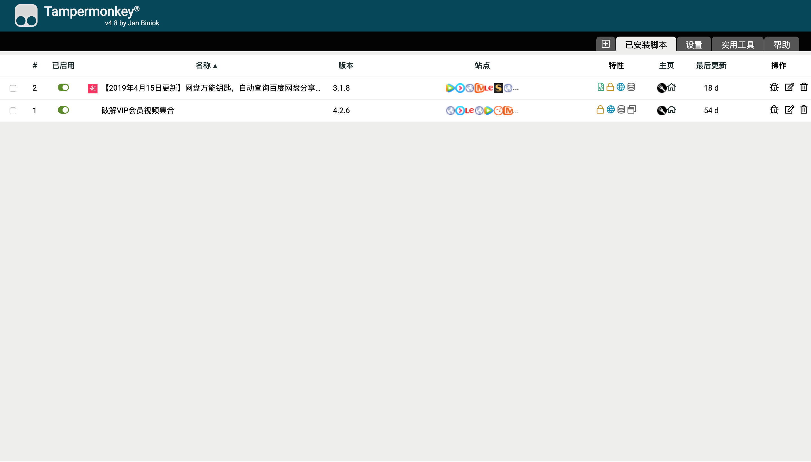
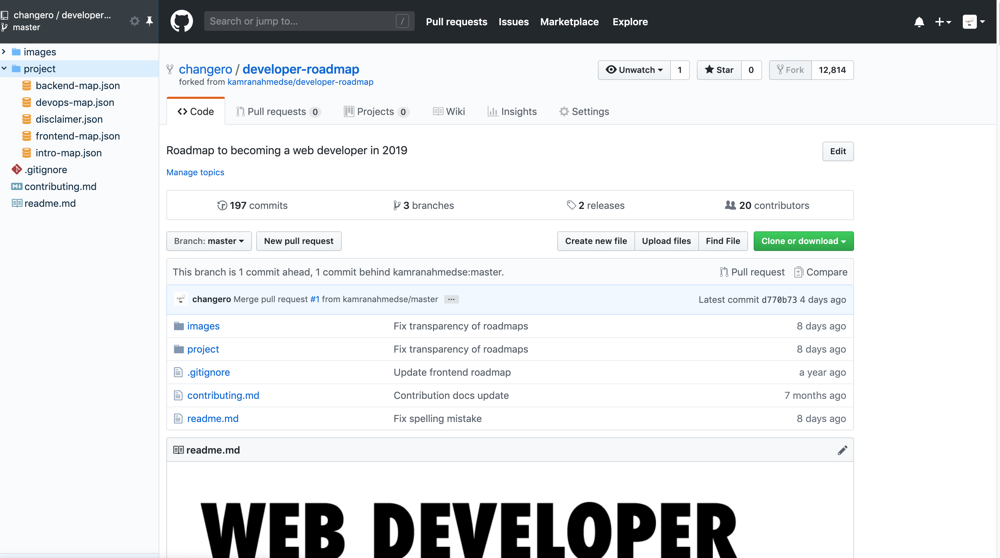
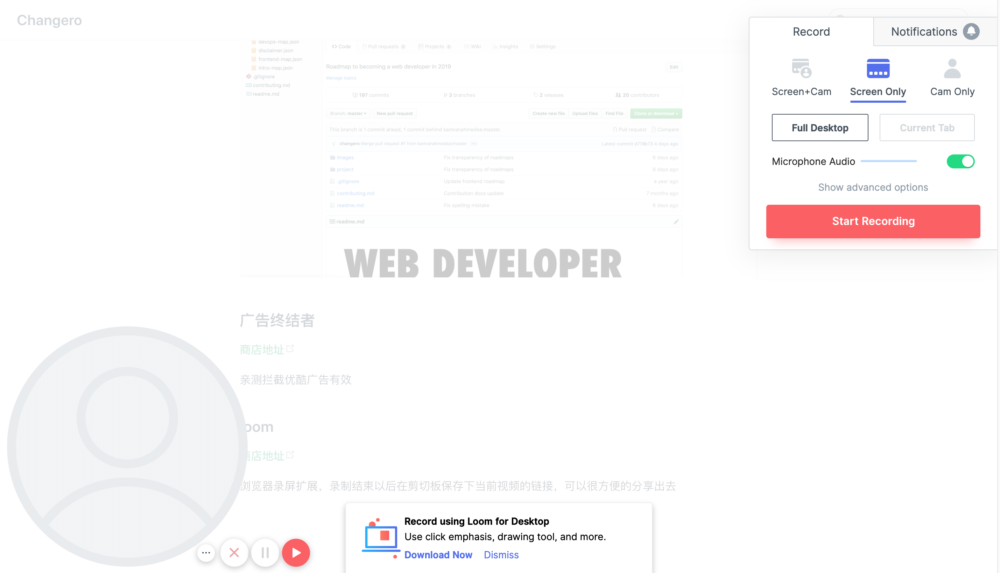
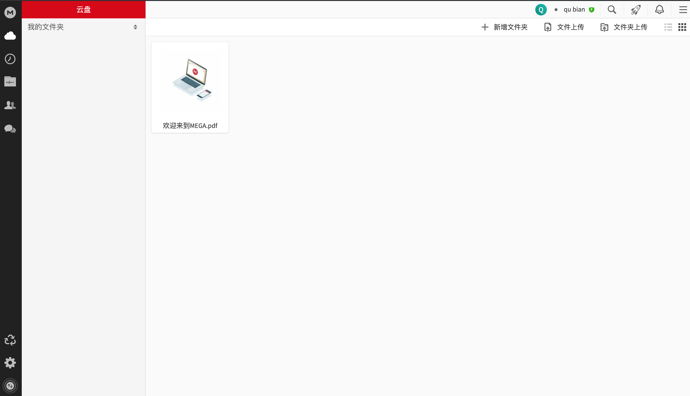
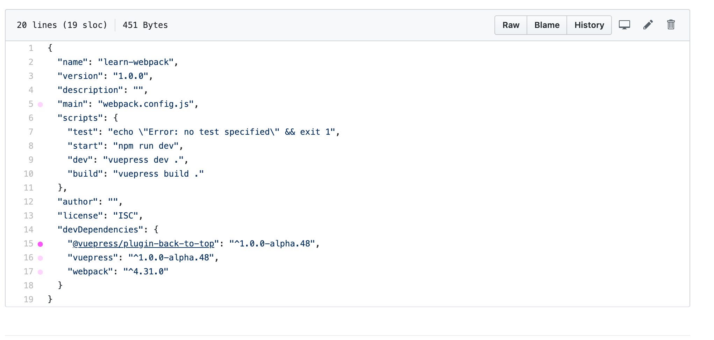

## chrome扩展

这里记录一下常用的chrome扩展，免得经常性的到处找。以下链接都是google商店地址，如果没有梯子，也可以到[crx4chrome](https://www.crx4chrome.com/)、[cnplugins](http://www.cnplugins.com/)、[chromecj](http://chromecj.com/)、[chrome666](https://www.chrome666.com/)、[extfans](https://extfans.com/)等商店上去寻找

### toby

[商店地址](https://chrome.google.com/webstore/detail/toby-for-chrome/hddnkoipeenegfoeaoibdmnaalmgkpip?utm_source=chrome-ntp-icon)

toby是我目前主力实用的网址管理工具，支持云同步，所以需要注册一个账号使用，唯一的不足就是无法保存站点账号密码

同时可以将自己平时的收藏放到一个集合里面并分享出去

这是它的[官方网站](http://www.gettoby.com)

~~另外推荐[Qlearly](https://chrome.google.com/webstore/detail/qlearly-tab-and-bookmark/aicaflgmmblfaneodjfhkilgplnpjmig/related)~~,实战发现，多端同步的能力稍弱

### SwitchyOmega

[商店地址](https://chrome.google.com/webstore/detail/proxy-switchyomega/padekgcemlokbadohgkifijomclgjgif?utm_source=chrome-ntp-icon)

SwitchyOmega是一款代理工具，往往配合梯子使用，如果是全局代理就可以忽略了。[github wiki](https://github.com/FelisCatus/SwitchyOmega/wiki/GFWList)

分享一个几乎永久使用的节点: `https://www.copyplay.net:443`

规则列表：`https://raw.githubusercontent.com/gfwlist/gfwlist/master/gfwlist.txt`

如果节点多的情况下，推荐创建一个虚拟情景模式。配置[参考](https://www.flyzy2005.com/tech/switchyomega-proxy-server/)

这样就可以很方便的在这里切换想要使用的代理节点

### Tampermonkey

[商店地址](https://chrome.google.com/webstore/detail/tampermonkey/dhdgffkkebhmkfjojejmpbldmpobfkfo?utm_source=chrome-ntp-icon)

[官网](https://www.tampermonkey.net/)

Tampermonkey的作用是使用脚本扩展访问的页面的功能，脚本使用js编写

脚本的下载网址：[greasyfork](https://greasyfork.org/zh-CN/scripts)、[国外](http://userscripts-mirror.org/)

推荐[脚本](https://greasyfork.org/zh-CN/scripts/370811-2019%E5%B9%B44%E6%9C%8815%E6%97%A5%E6%9B%B4%E6%96%B0-%E7%BD%91%E7%9B%98%E4%B8%87%E8%83%BD%E9%92%A5%E5%8C%99-%E8%87%AA%E5%8A%A8%E6%9F%A5%E8%AF%A2%E7%99%BE%E5%BA%A6%E7%BD%91%E7%9B%98%E5%88%86%E4%BA%AB%E9%93%BE%E6%8E%A5%E7%9A%84%E6%8F%90%E5%8F%96%E7%A0%81-%E5%85%A8%E7%BD%91vip%E8%A7%86%E9%A2%91%E8%A7%A3%E6%9E%90%E6%92%AD%E6%94%BE-%E5%85%A8%E7%BD%91%E4%BB%98%E8%B4%B9%E9%9F%B3%E4%B9%90%E5%85%8D%E8%B4%B9%E4%B8%8B%E8%BD%BD-%E6%B7%98%E5%AE%9D-%E6%8B%BC%E5%A4%9A%E5%A4%9A%E5%A4%A7%E9%A2%9D%E8%B4%AD%E7%89%A9%E4%BC%98%E6%83%A0%E5%88%B8%E9%A2%86%E5%8F%96-%E6%94%AF%E6%8C%81%E5%8E%86%E5%8F%B2%E4%BB%B7%E6%A0%BC%E6%9F%A5%E8%AF%A2),可以破解百度网盘的分享

### octotree

[商店地址](https://chrome.google.com/webstore/detail/octotree/bkhaagjahfmjljalopjnoealnfndnagc?utm_source=chrome-ntp-icon)

使用这个插件以后，在访问[github](https://www.github.com)仓库的时候，会在左边呈现一个当前仓库所有文件的列表，这样在访问层级很深的文件的时候就会很方便

### 广告终结者

[商店地址](https://chrome.google.com/webstore/detail/%E5%B9%BF%E5%91%8A%E7%BB%88%E7%BB%93%E8%80%85/fpdnjdlbdmifoocedhkighhlbchbiikl?utm_source=chrome-ntp-icon)

亲测拦截优酷广告有效

### loom

[商店地址](https://chrome.google.com/webstore/detail/loom-video-recorder-scree/liecbddmkiiihnedobmlmillhodjkdmb?utm_source=chrome-ntp-icon)

浏览器录屏扩展，录制结束以后在剪切板保存下当前视频的链接，可以很方便的分享出去

### youtube广告拦截

[商店地址](https://chrome.google.com/webstore/detail/video-adblocker-for-youtu/hflefjhkfeiaignkclmphmokmmbhbhik)

### mega

免费的50G云盘，[商店地址](https://chrome.google.com/webstore/detail/mega/bigefpfhnfcobdlfbedofhhaibnlghod/related)

### octolinker

[商店地址](https://chrome.google.com/webstore/detail/octolinker/jlmafbaeoofdegohdhinkhilhclaklkp/related)

查看github仓库代码的时候可以很方便的跳转到其依赖的库

### npmhub

[商店地址](https://chrome.google.com/webstore/detail/npmhub/kbbbjimdjbjclaebffknlabpogocablj/related)

扫描出`package.json`文件中的依赖，显示在`README`下面